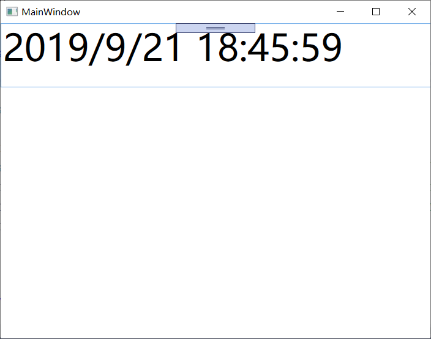
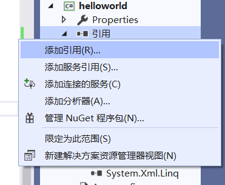
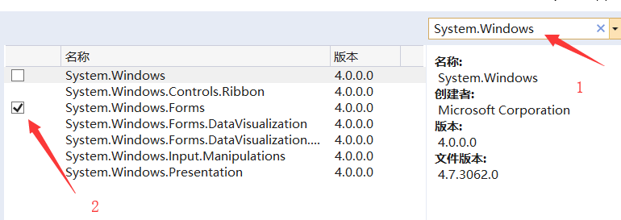
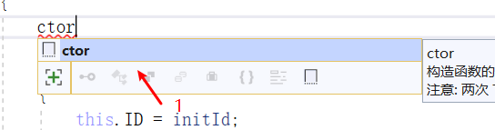
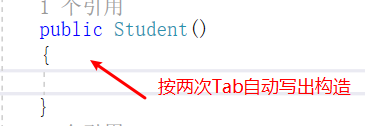
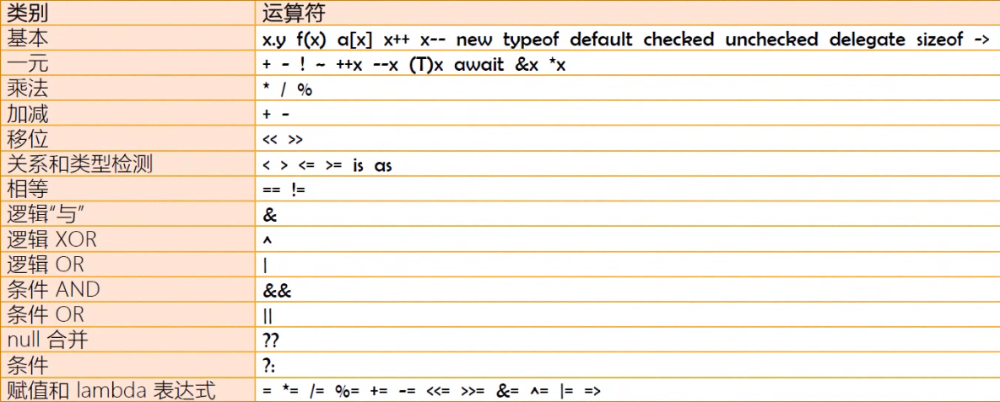

#C#语言入门

##对象

```
using System;
using System.Collections.Generic;
using System.Linq;
using System.Threading.Tasks;
using System.Windows.Forms;

namespace WindowsFormsApp1
{
    static class Program{
        static void Main(){
            Form form1 = new Form();
            Form form2 = form1;  // 引用同一个对象
            form1.Text = "my form";
            form2.ShowDialog(); // 窗口的title 是 my form
        }
    }
}
```
属性：存储数据，组合起来表示这个对象状态。
方法：函数。
事件：类或对象通知其他类。C#特有。

```
//using ......
using System.Windows.Threading;
namespace WpfApp
{
    public partial class MainWindow : Window
    {
        public MainWindow()
        {
            InitializeComponent();
            DispatcherTimer timer = new DispatcherTimer(); //初始化定时器
            timer.Interval = TimeSpan.FromSeconds(1); //一秒钟生成一个timespan
            timer.Tick += Timer_Tick; //当tick事件发生时，执行Timer_Tick方法
            timer.Start();
        }

        private void Timer_Tick(object sender, EventArgs e)
        {
            this.TimeBox.Text = DateTime.Now.ToString();
        }
    }
}
```



每一秒更新一次时间

* 静态成员:类的成员 所有的对象共享
* 实例:对象的成员 每个对象私有
* 绑定：编译器把一个成员与类或对象关联起来
   * `.`操作符可以访问成员

##关键字
参考：C# refrence

加入 `System.Windows.forms;`模块:






动态类型：dynamic 
类似于js里面的var关键字

```
    static void Main(string[] args)
    {
        dynamic v = 100;
        Console.WriteLine(v);
        v = "ok";
        Console.WriteLine(v);
    }
```


在C#中 单纯的小数默认是double类型，如果要用float类型后面必须加f

如：float f = 3.14f;

同样 数字默认是int 如果要用长整型必须加l

如：long l = 100l;

类型名|范围|大小
--:|--:|--:
sbyte|-128~127|8bit
byte|0~255|8bit
char|U+00000~U+fffff|Unicode 16bit
short|-32768~32767|Singed 16bit
ushor|-|unsinged 16bit
int|-2147483648~2147483647|singed 32bit
uint|-|unsinged 32bit
long|-|singed 64bit
ulong|-|unsinged 64bit
float|7 digits|32bit
double|15~16 digits|64bit

得到类型：

```
static void Main(string[] args)
{
    Type myType = typeof(Form);
    Console.WriteLine(myType.FullName); 
    //System.Windows.Forms.Form
    Console.WriteLine(myType.BaseType.FullName);
    //System.Windows.Forms.ContainerControl
    Console.ReadLine();
}
```

##C#中的构造器

和C++类似，public + 类名 + 参数，可重载
C#中构造器不进行初始化编译器默认把内存初始化为0，也就是null
```
    class Student
    {
        public Student()
        {}
        public Student(int initId,string initName) 
        {
            this.ID = initId;
            this.Name = initName;
        }
        public int ID;
        public string Name;
    }
```
tips:






##重载

签名规则和c++类似

泛型方法也算作签名。
传引用也算
注意 out和ref是不能同时存在的
```
    class Add
    {
        public double add(int x, int y)
        {
            return x + y;
        }
        public T add<T>(T x, T y) // 这里是可以重载的
        {
            return x;
        }
        public int add(ref int x, int y)
        {
            return x + y;
        }
        /* 不能和ref重载
        public int add(out int x, int y)
        {
            return x + y;
        }
        */
    }
```


##操作符


操作符优先级从高到底(从上到下)



重载规则和C++类似

```
class Program
    {
        static void Main(string[] args)
        {
            Foo f1 = new Foo(1);
            Foo f2 = new Foo(2);
            List<Foo> res = f1 + f2;
            foreach(var n in res)
            {
                Console.WriteLine(n._id);
            }
            Console.Read();
        }
    }
    class Foo
    {
        public int _id;
        public Foo(int id)
        {
            this._id = id;
        }
        public static List<Foo> operator+(Foo f1, Foo f2)
        {
            List<Foo> l = new List<Foo>();
            l.Add(f1);
            l.Add(f2);
            return l;
        }
    }
```

###委托方法

```
class Program
    {
        static void Main(string[] args)
        {
            Action action = new Action(Foo.PrintHello);
            action(); // 打印出hello 和PrintHello方法一样
            Console.Read();
        }
    }
    class Foo
    {
        public static void PrintHello()
        {
            Console.WriteLine("hello");
        }
    }
```

`[]` 索引运算

```
    class Program
    {
        static void Main(string[] args)
        {
            int[] arr = new int[10];
            int[] arr2 = new int[] { 1, 2, 3, 4, 5 };//初始化列表
            Dictionary<string, Student> stuDict = new Dictionary<string, Student>();
            for (int i = 0; i < 100; i++)
            {
                Student stu = new Student();
                stu.Name = "S" + i.ToString();
                stu.Score = 100 + i;
                stuDict.Add(stu.Name, stu);
            }
            Console.WriteLine(stuDict["S6"].Score); // []不一定是数字
        }
    }
    class Student
    {
        public string Name;
        public int Score;
    }
```


