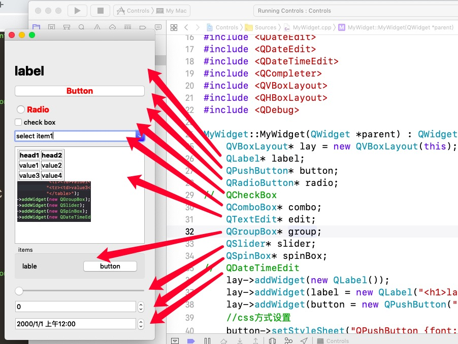

#QT5

> ###PC系统环境:Mojave 10.14.2
> ###Qt版本:5.7.1 IDE:Xcode10

##窗口创建

* 先创建一个新的空项目
* 添加c++类，MyWidget 父类是QWidget

```
#include <QApplication>
#include <QWidget>
class MyWidget : public QWidget
{
    Q_OBJECT
public:
    explicit MyWidget(QWidget *parent = 0);
    
signals:

public slots:
    void slotComboBoxIndexChanged(const QString&);
};

```

##常用控件

* ###下面展示几个常用控件以及其调用方式


> 一般我们会创建一个layout，layout会根据窗口大小分配控件的位置
> QVBoxLayout 上下分配
> QHBoxLayout 左右分配
> QGridLayout 按格子显示布局

* 其中QVBoxLayout和QHBoxLayout 可以通过添加控件addWidget 和添加弹簧addStretch 来调整界面
* QGridLayout直接添加控件对象后跟坐标位置
```
//QVBoxLayout或QHBoxLayout
//后面的数字是控件所占比重
	lay->addStretch(1);
    lay->addWidget(new QLabel(),1);
	lay->addStretch(1);
```
```
	//....
//QGridLayout,对象后面跟格子坐标
	lay->addWidget( new QLineEdit() , 2 , 2 );
	lay->addWidget( new QPushButton(), 2 , 3 );
	//....
```

> * Label一般显示一行文字信息(支持html)

```
 lay->addWidget(label = new QLabel("<h1>label</h1>"));
```

> * Button 按钮

```
//css方式设置
    button->setStyleSheet("QPushButton {font:bold 16px; color:red}");
//按下Button后执行lambda表达式
    connect(button, &QPushButton::clicked,[](){
        qDebug() << "Button clicked";//在终端打印
    });
```

> * ComboBox,一般会提供选项，当用户选择之后会调用一个函数来处理结果

```
 //添加进layout
 lay->addWidget(combo = new QComboBox());
 //设置选项
    combo->addItem("select item1");
    combo->addItem("select item2");
    combo->setEditable(true);
    combo->setCompleter(new QCompleter(combo->model()));
 
//链接到slotComboBoxIndexChanged来处理选择后的结果
    connect(combo, SIGNAL(currentIndexChanged(QString)), this, SLOT(slotComboBoxIndexChanged(QString)));
    
//函数slotComboBoxIndexChanged的实现
void MyWidget::slotComboBoxIndexChanged(const QString& str){
    qDebug() << str;//将选择的字符串打印到终端
}

```
> * Radio和checkbox类似只有两个输入参数(true和false)

```
 radio->setStyleSheet("QRadioButton {font:bold 16px; color:red; padding:5px}");

//打印选择的结果
    connect(radio,&QRadioButton::clicked,[](bool v){
        qDebug() << v;
    });
```
> * QTextEdit 对话框可以使用html进行界面设计图片显示等

```
lay->addWidget(edit = new QTextEdit);
//html方式
edit->setText("<table border=1><tr><th>head1</th><th>head2</th></tr>"
                  "<tr><td>value1</td><td>value2</td></tr>"
                  "<tr><td>value3</td><td>value4</td></tr>"
                  "</table><br>"
                  "</img>"
                  );
//将用户输入的值打印出来
connect(edit, &QTextEdit::textChanged, [=](){
        qDebug() << edit->toPlainText();
    });
```

> * GroupBox 一组控件，可以在一个group里面添加多个控件

```
//添加一个Hlayout
QHBoxLayout* hBoxlay;
    group->setLayout(hBoxlay = new QHBoxLayout);
    hBoxlay->addWidget(new QLabel("lable"));//在group增加一个Label
    hBoxlay->addWidget(new QPushButton("button"));//增加一个Button
```

> * slider和spinBox 提供一个数字选择的拉条或输入框

```
//滑条
	QSlider* slider;
    lay->addWidget(slider = new QSlider(Qt::Horizontal));
    //设置最大最小值
    slider->setMaximum(100);
    slider->setMinimum(0);
//输入框
    QSpinBox* spinBox;
    lay->addWidget(spinBox = new QSpinBox);
    //设置最大最小值
    spinBox->setMaximum(100);
    spinBox->setMinimum(0);
    //得到一个数值在slider中给spinBox设置所选的数值
    connect(slider, SIGNAL(valueChanged(int)), spinBox, SLOT(setValue(int)));
    //得到一个数值在spinBox中给slider设置所选的数值
    connect(spinBox, SIGNAL(valueChanged(int)), slider, SLOT(setValue(int)));
    //这样做就会让slider和spinBox两个数值是保持一样的
```

* 主函数

```

int main(int argc,char** argv){
    QApplication app(argc,argv);

    MyWidget w;
    w.show();
    return app.exec();
}

```
