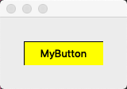

#QPainter

##QPainter自制画板

> paintEvent:绘制信号,窗口创建或调用Update函数会向App发出绘制信号
> mouseMoveEvent;鼠标移动信号，默认情况下必须要鼠标点击后再移动才会进入此函数
> mousePressEvent:鼠标点击信号

* ####在点击鼠标后移动的情况下会调用一次mousePressEvent然后在调用多次mouseMoveEvent

类：重载鼠标信号，和绘制信号函数
```
class MyWidget : public QWidget
{
    Q_OBJECT
public:
    QVector< QVector<QPoint> > _lines;
public:
    explicit MyWidget(QWidget *parent = 0);
    void paintEvent(QPaintEvent *);
    void mouseMoveEvent(QMouseEvent *event);
    void mousePressEvent(QMouseEvent *event);
    void mouseReleaseEvent(QMouseEvent *);
signals:
public slots:
};
```

####绘制信号函数：
* 当进入这个函数时，创建一个QPainter对象再，将记录下来的pointers(Vector)绘制再窗口中

```
void MyWidget::paintEvent(QPaintEvent *){
    QPainter p(this);
    for(int i = 0;i < _lines.size(); ++i){
        const QVector<QPoint>& line = _lines.at(i);
        for(int j = 0; j< line.size() - 1; ++j){
            p.drawLine(line.at(j),line.at(j+1));
        }
    }
}
```
####移动信号
* 当鼠标移动时(点击状态下),读取当前鼠标的位置并加入最后一段line中

```
void MyWidget::mouseMoveEvent(QMouseEvent *event){
    if(_lines.size() == 0){
        QVector<QPoint> line;
        _lines.append(line);
    }

    QVector<QPoint>& lastLine = _lines.last();
    lastLine.append(event->pos());
    update();
}
```

####鼠标点击
* 鼠标点击时新建一个line加入线段组中，并将当前鼠标位置作为第一个点添加进去

```
void MyWidget::mousePressEvent(QMouseEvent *event){
    QVector<QPoint> line;
    _lines.append(line);

    QVector<QPoint>& lastLine = _lines.last();
    lastLine.append(event->pos());
}
```

##自定义Button

自定义控件再很多情况下能美化界面。

* 先确定Button的大小和其能显示的内容
* 是否被点击以及和QPushbutton类似的构造函数

```
	MyButton(const QString& text,QWidget* parent = 0);
	QRect _rect;
    QString _text;
    bool _pressed;
```

效果:
点击前


点击后



完整的类定义:
```
class MyButton : public QWidget
{
    Q_OBJECT
public:
    explicit MyButton(QWidget *parent = 0);
    MyButton(const QString& text,QWidget* parent = 0);

    QRect _rect;
    QString _text;
    bool _pressed;

    void mousePressEvent(QMouseEvent*);
    void mouseReleaseEvent(QMouseEvent*);
    void paintEvent(QPaintEvent*);

signals:
    void clicked();//自定义绑定
public slots:
};
```
实现:
```
#include "mybutton.h"
//将得到的字符信息放在Button上，并且支持修改其大小
MyButton::MyButton(QWidget *parent) : QWidget(parent),_rect(0,0,100,30),_text(QString()),_pressed(false)
{
this->setGeometry(_rect);
}

MyButton::MyButton(const QString &text, QWidget *parent) : QWidget(parent), _text(text), _rect(0,0,100,30),_pressed(false){
this->setGeometry(_rect);
}

//鼠标点击后将_pressed至true，并调用update给用户反馈
void MyButton::mousePressEvent(QMouseEvent *){
    _pressed = true;
    update();
}
void MyButton::mouseReleaseEvent(QMouseEvent *event){
    _pressed = false;
    if(_rect.contains(event->pos()))
        emit clicked();//发射一个信号
    update();
}
//根据是否被点击来变换颜色
void MyButton::paintEvent(QPaintEvent*){
    QPainter p(this);
    if(_pressed == true)
        p.setBrush(Qt::yellow);
    else
        p.setBrush(Qt::darkGray);
    p.drawRect(_rect);
    p.drawText(_rect,_text,QTextOption(Qt::AlignCenter));

}
```

