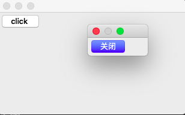
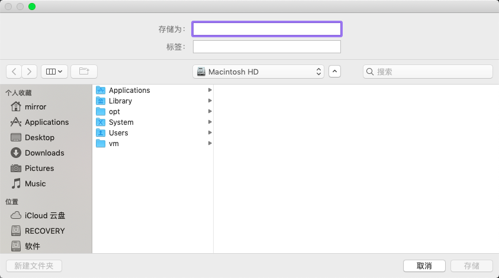
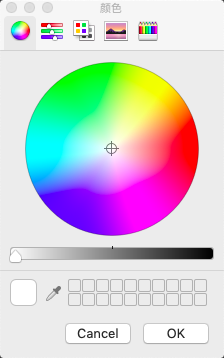
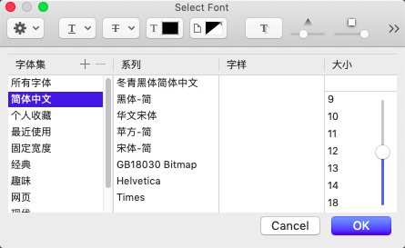
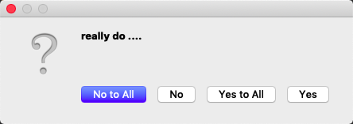

#Dialog和QMainWindow

##Dialog

Dialog窗口和普通窗口基本一样,可以添加控件等

```
MyDialog::MyDialog(QWidget* parent) : QDialog(parent){
    QPushButton* button = new QPushButton("click ",this);
    connect(button, SIGNAL(clicked()), this, SLOT(slotButtonClicked()));
}
```


但没有最小化,并且固定大小

###模块对话框

当我们点击Button时会弹出一个弹窗,如果时使用，exec的话该弹窗关闭之前，上一级窗口不能操作
当我们使用show()来显示弹窗的话，上一级和弹窗都可以操作

> 模块对话框中exec有自己的消息循环，并且把app的消息接管
> 这个对话框不关闭就不能继续操作其他对话框



编写槽函数slotButtonClicked如下：
```
void MyDialog::slotButtonClicked(){
    QDialog* dig = new QDialog;
    QPushButton* button = new QPushButton("关闭",dig);
    connect(button, SIGNAL(clicked()),dig, SLOT(accept()));
    int ret;
    //如果是通过exec显示那么可以通过accept rejected来关闭窗口
    //如果是同show来显示就可以用close关闭窗口
    ret = dig->exec();
    //点击关闭按钮，调用accept关闭
    if(ret == QDialog::Accepted){
        qDebug() << "accepted";
    }
    //点击x键关闭的窗口
    if(ret == QDialog::Rejected){
        qDebug() << "rejected";
    }
```

###系统中的模块对话框

保存文件:



> 选择文件后，会返回一个文件路径字符串

```
void MyDialog::slotButtonClicked(){
 //保存文件
    
     //第三个参数过滤文件类型
    QString strFilename = QFileDialog::getSaveFileName(nullptr,"select save file name",_strdir,"Png file (*.png)");
    
    //打开文件
    /*
    QString strFilename = QFileDialog::getOpenFileName(nullptr,"select open file name",_strdir,"Png file (*.png)");
     */
    //选择目录
    /*
    QString strFilename = QFileDialog::getExistingDirectory();
    */
    
    if(strFilename.isEmpty()){
        qDebug() << "select none";
        return;
    }
    qDebug() << strFilename;//返回文件的目录
    //记录文件路径
    QFileInfo fileInfo(strFilename);
    _strdir = fileInfo.filePath();
    //保存文件
}
```

调色盘:
会返回一个QColor对象



```
  QColorDialog color;
    color.exec();
    QColor c = color.selectedColor();//返回QColor对象
```
字体选择
返回QFont对象



```
QFontDialog fontDialog;
    fontDialog.exec();
    QFont font = fontDialog.selectedFont();
```

MessageBox:



返回选择的结果

```
    int ret = QMessageBox::question(this, "???", "really do ....",
                                    QMessageBox::Yes|QMessageBox::No|
                                    QMessageBox::YesAll|QMessageBox::NoAll);
    if(ret == QMessageBox::Yes){
        qDebug() << "select yes";
    }
    if(ret == QMessageBox::No){
        qDebug() << "select No";
    }
```


##QMainWindow
