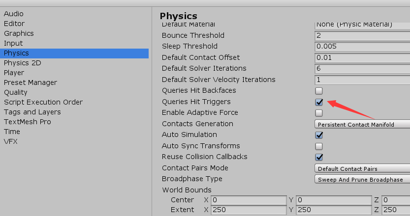
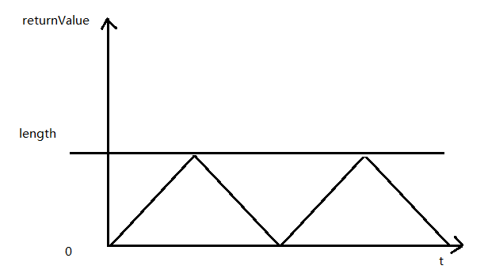

#UnityAPI笔记

##Time

摘抄自 ：https://blog.csdn.net/sinat_37730224/article/details/79230706

只读:

* Time.time：表示从游戏开发到现在的时间，会随着游戏的暂停而停止计算。
* Time.deltaTime：表示从上一帧到当前帧的时间，以秒为单位。
* Time.unscaledDeltaTime：不考虑timescale时候与deltaTime相同，若timescale被设置，则无效。
* Time.timeSinceLevelLoad：表示从当前Scene开始到目前为止的时间，也会随着暂停操作而停止。
* Time.unscaledTime：不考虑timescale时候与time相同，若timescale被设置，则无效。
* Time.fixedDeltaTime：表示以秒计间隔，在物理和其他固定帧率进行更新，在Edit->ProjectSettings->Time的Fixed Timestep可以自行设置。
* Time.realtimeSinceStartup： 表示自游戏开始后的总时间，即使暂停也会不断的增加。
* Time.frameCount：总帧数

可读可写:

* Time.fixedTime：表示以秒计游戏开始的时间，固定时间以定期间隔更新（相当于* * fixedDeltaTime）直到达到time属性。
* Time.SmoothDeltaTime：表示一个平稳的deltaTime，根据前 N帧的时间加权平均的值。
* Time.timeScale：时间缩放，默认值为1，若设置<1，表示时间减慢，若设置>1,表示时间加快，可以用来加速和减速游戏，非常有用。
* Time.captureFramerate：表示设置每秒的帧率，然后不考虑真实时间。


##创建游戏对象的三种方式

1. new GameObject("obj name")
2. 根据prefabs
   * public GameObject prefab; //外部赋值
   * //...
   * GameObject.Instantiate(prefab);
3. 创建基本游戏对象
   * GameObject.CreatePrimitive(PrimitiveType.Cube) //只能是Cube Plane Sphere等基本形状

##UnityEngine下Object用有的静态方法
```
Destory(gameObject)//销毁某个游戏物体
Destory(gameObject, 5)//5秒后销毁某个游戏物体
Destory(this)//销毁脚本组件
Destory(rigidbody)//销毁刚体组件
```

`DontDestoryOnLoad(transform.gameObject)// 切换场景时不销毁游戏物体,当游戏场景切换时保留上个场景里面的游戏物体`

`public static Object FindObjectOfType(Type type);//根据游戏物体类型查找游戏物体,找到第一个符合条件的物体就立刻返回`

`public static Object[] FindObjectsOfType(Type type);//根据游戏物体类型查找游戏物体,返回一个数组返回所有符合条件的游戏物体`

注意：上面两个不能查找未激活的游戏物体


`Instantiate(Object original, Transform parent, bool instantiateWorldSpace);`
指定是否使用世界坐标

`Instantiate(Object original, Vector3 position, Quaternion rotation, Transform parent);`
复制游戏对象，指定初始位置，指定旋转，指定父对象


##协程

**协程是和主程序并行的并且可以暂停**

使用方法 

```
    void Start(){
        StartCoroutine(ChangeColor());
    }
    IEnumerator ChangeColor(){
        cube.GetComponent<MeshRenderer>().material.color = Color.red;
        yield return new WaitForSeconds(1);
        cube.GetComponent<MeshRenderer>().material.color = Color.blue;
        yield return null; //这里返回null或者0
    }
```

利用协程实现渐变效果

```
    void Update(){
        if (Input.GetKeyDown(KeyCode.Space)){
            StartCoroutine(Fade());
        }
    }
    IEnumerator Fade(){
        for(float i = 0; i <= 1; i += 0.01f) {
            cube.GetComponent<MeshRenderer>().material.color = new Color(i, i, i, i);
            yield return new WaitForSeconds(0.01f);
        }
        yield return null;
    }
```

相关的API
`StartCoroutine` `StopCoroutine` `StopAllCoroutine`

**注意：**

* 如果使用的StartCoroutine(IEnumerator  method)这种方式停止的时候也要使用StopCoroutine(IEnumerator  method)
* 如果使用的是StartCoroutine(string methodName)关闭也要使用停止的时候要使用StopCoroutine(string methodName)

##Message

关于mouse：
OnMouseDown : 鼠标按下
OnMouseUp : 鼠标抬起
OnMouseDrag : 鼠标按下并拖拽
OnMouseEnter : 鼠标移上去的时候触发
OnMouseExit : 鼠标移出的时候触发
OnMouseOver : 鼠标停留的时候,每一帧都执行
OnMouseAsButton : 点击时触发，按下并且抬起

要监听的游戏物体必须添加`Collider` 

如果碰撞器是 `isTrigger`


必须在Edit -> Physicals里面 选上
 



##Mathf

常数：

Deg2Rad : 度数转弧度

Rad2Deg : 弧度转度数

PI : 圆周率

Epsilon : 无限小并且大于0 ( anyValue + Epsilon = anyValue  、anyValue - Epsilon = anyValue 、Epsilon -> 0 )

Infinity : 无限大 正无穷

NegativeInfiniy : 无限小 负无穷

方法：
Ceil 向上取整 （10.2 返回 11  、-10.2 返回 -10）

CeilToInt : Ceil返回float类型的整数，此函数返回Int类型的整数

Floor : 向下取整

float Clamp(float value, float min, float max) : value 的值小于 min 返回 min value值小于max则返回max，valu的值处于min和max之间 返回value本值

 ClosestPowerOfTwo : 返回最靠近 输入值的 2的n次方数值 （输入30 返回 32 输入 1 返回2 输入5 返回4 ）

DeltaAngle : 两个角度最小的夹角 (与360 取余 相减)

插值运算：float Lerp(float a, float b, float t);

> 开始值 a 结束值b 插值t

> t是一个比例值 范围[0,1]
> 假如输入a=10 b=20 t = 1 则返回20 如果t = 0 则返回10 如果 t = 0.5 则返回15
> returnValue = (b - a) * t + a 

使用Lerp控制移动

```
    void Start(){
        cube.transform.position = new Vector3(0, 0, 0);
    }
    void Update(){
        float x = cube.transform.position.x;
        cube.transform.position = new Vector3(Mathf.Lerp(x, 10, 0.01f), 0, 0);
    }
```

这样写会先快后慢，会动态读取物体的x坐标位置每次a和b会接近，而t不变所以会变慢

`float MoveTowards(float current, float target, float maxDelta);`

关于这个函数最大的区别是
 > returnValue = current + mmaxDelta 但保证不超过target 这个mmaxDelta 可以为负值，但会远离目标

```
    void Update(){
        float x = cube.transform.position.x;
        cube.transform.position = new Vector3(Mathf.MoveTowards(x,10,Time.deltaTime), 0, 0);
    }
```

`float PingPong(float t, float length);`

此函数的返回值是在[0, length]之间

> 当t在[0,length]之间时，会返回t的值，当t大于length时
> returnValue = length- (t - length) 
> 当t大于2倍length时
> returnValue = t - 2length
> 以此类推



**因此我们通常使用Time.time作为t的值**

```
    void Update(){
        float x = cube.transform.position.x;
        cube.transform.position = new Vector3(5 + Mathf.PingPong(Time.time, 5), 0, 0);
    }

```
在5-10之间来回运动


