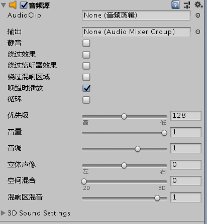

#音频

> Unity中主要支持aiff和wav为短音效，mp3和ogg为长音乐

##参数



AudioListener ： 为收听音乐组件
AudioSource ： 为播放音乐组件

###AudioSource主要参数

Audio Clip：音乐剪辑
Mute ： 是否静音
Play On Awake ： 是否自动播放
Loop ： 是否循环播放
Volume ：音量 ， 0 ~1 float类型

##脚本

按下W键播放

```

private AudioSource audioSource1;
//....

audioSource1 = GetComponent<AudioSource>();
//....

if (Input.GetKeyDown(KeyCode.W))
{
    audioSource1.Play();
}

```

