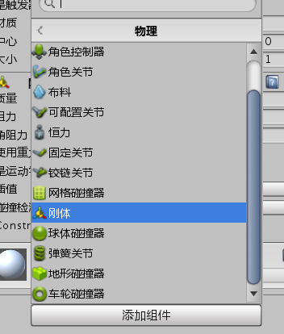
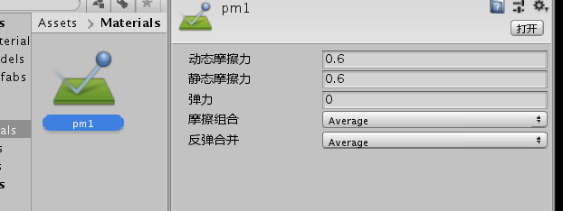
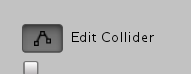
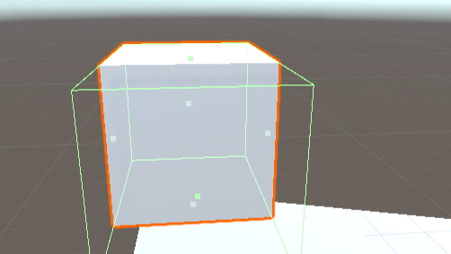
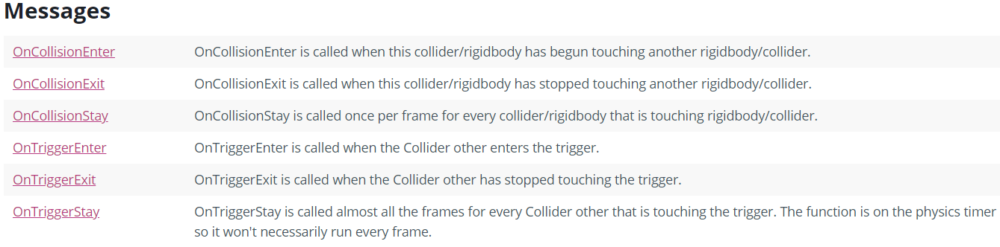
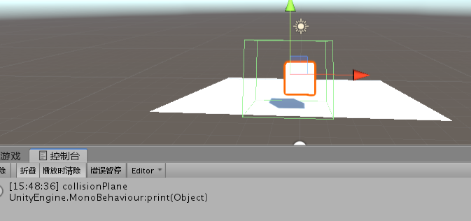

#刚体

##设置刚体以及碰撞盒




##设置力

```
        if (Input.GetKeyDown(KeyCode.W))
        {
            rigidBody.AddForce(new Vector3(0, 0, 5),ForceMode.Impulse);//添加力
        } // 只需要调用一次
        //ForceMode.Acceleration 牵引力 产生匀速运动的时候不断施加的一个力
        //ForceMode.Impulse 脉冲力 极端的时间内作用于物体

        if (Input.GetKey(KeyCode.S))
        {
            rigidBody.AddForce(new Vector3(1, 1, 0) * 3, ForceMode.Acceleration); // 每一帧都要调用
        }
```

##设置速度

```
        if (Input.GetKeyDown(KeyCode.D))
        {
            rigidBody.velocity = new Vector3(0, 0, 1) * 10;
        }
```

##碰撞检测

必要条件：碰撞双方必须都要有碰撞体，至少有一方是刚体

设置物理材质



托加到plane上面

通过Edit  Collider 来调整碰撞盒





碰撞消息的三个状态：Enter -> Stay -> Exit



官网示例

```
using UnityEngine;
using System.Collections;

public class ExampleClass : MonoBehaviour
{
    AudioSource audioSource;

    void Start()
    {
        audioSource = GetComponent<AudioSource>();
    }

    void OnCollisionEnter(Collision collision)
    {
        foreach (ContactPoint contact in collision.contacts)
        {
            Debug.DrawRay(contact.point, contact.normal, Color.white);
        }
        if (collision.relativeVelocity.magnitude > 2)
            audioSource.Play();
    }
}
```

打印碰到物体的名字

```
 void OnCollisionEnter(Collision collision)
    {
        print("collision" + collision.gameObject.name);
    }
```



只有一帧捕获到碰撞


