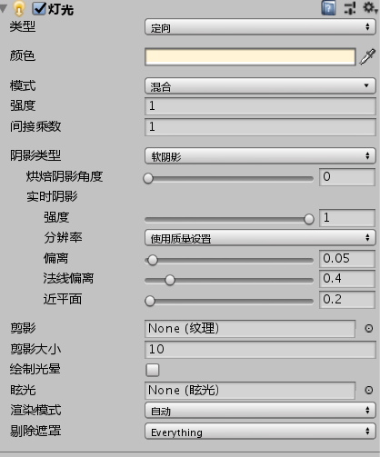
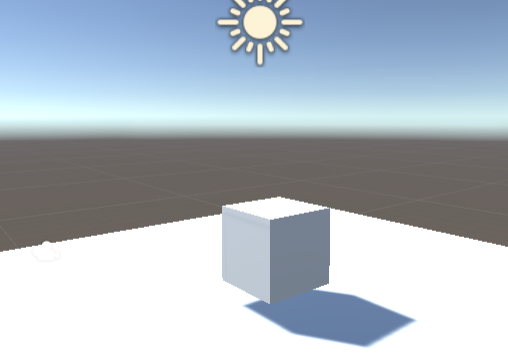
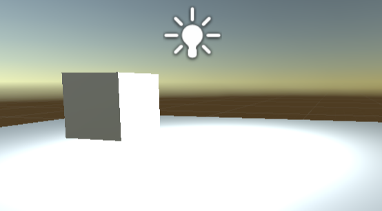
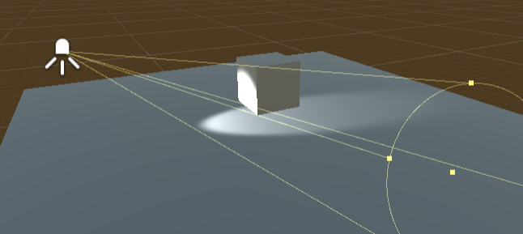
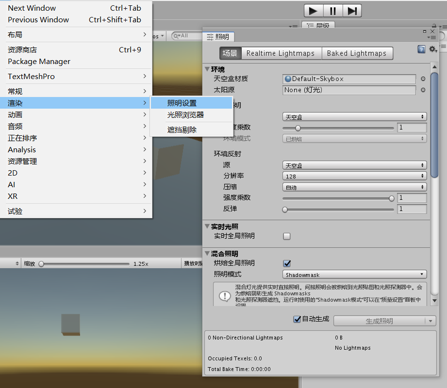
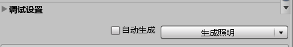
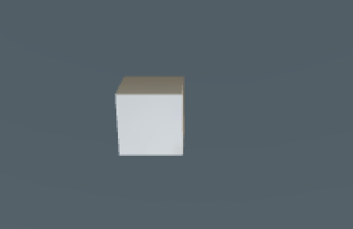

#光照

##Unity中的光源

名称|作用|实时渲染
--:|--:|:--
平行光|一束平行光线，如阳光|可实时，可烘焙
点光|从一个点向四周发散，可通过组件改变范围和强度|可实时，可烘焙
聚光|从一点发散照射角度狭窄、集聚于局部的光线|可实时，可烘焙
范围光|一个区域的光，没有方向|只能烘焙

##预览

平行光

点光源

聚光

##烘焙

光照烘焙详解:

[**传送门**](Unity 5.6 光照烘焙系统介绍 - 云+社区 - 腾讯云.html)

