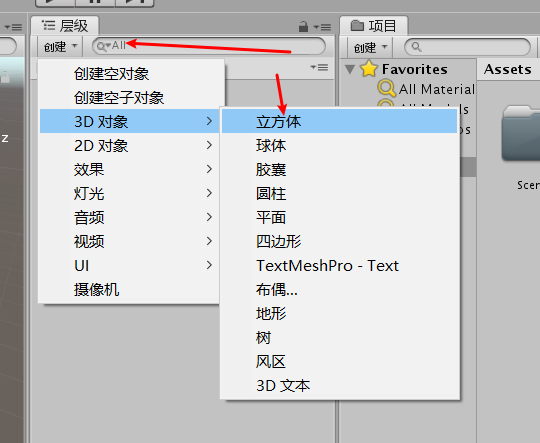
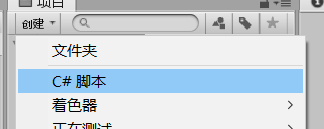
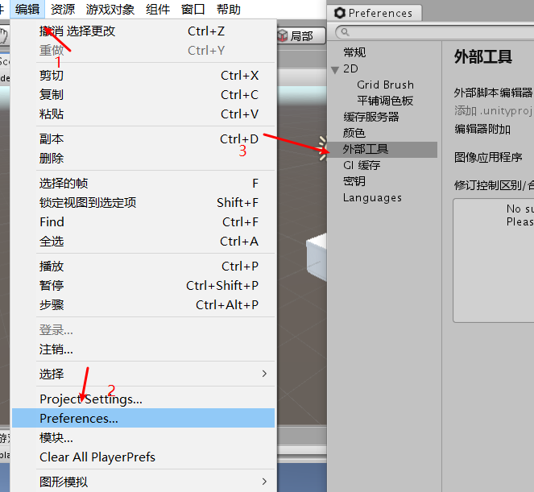
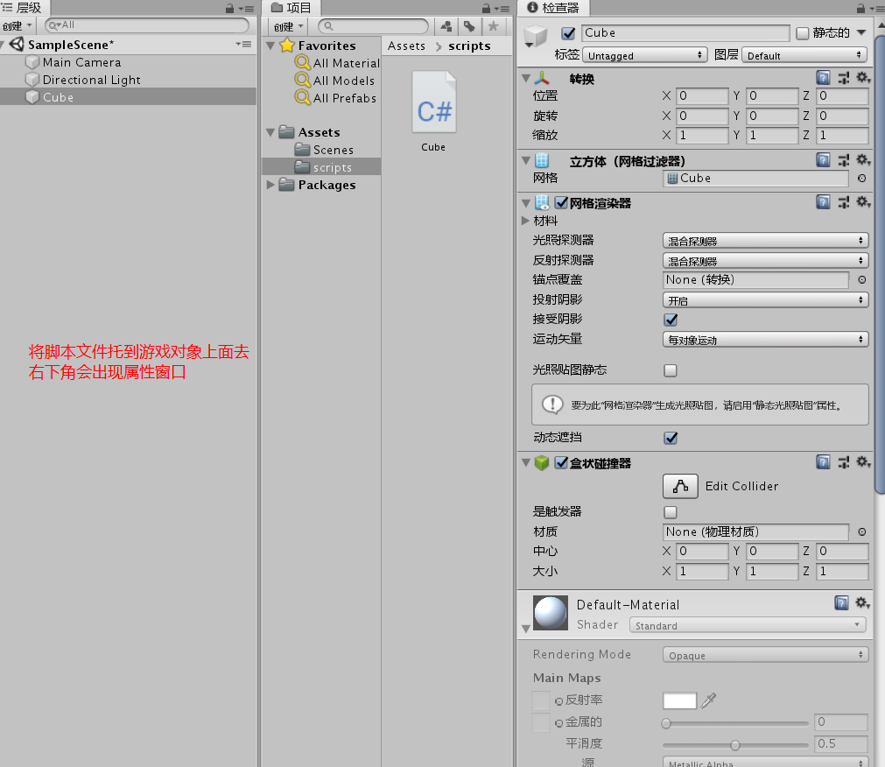
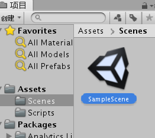

#Hello，World

在一个正方体能用wasd控制方向

##创建工程


##创建3D对象



##创建脚本和修改编译器

###注意：脚本在编写时类名要和对象名保持一样否则会报错









##保存场景



##发布


##效果图


##代码

```
using System.Collections;
using System.Collections.Generic;
using UnityEngine;

public class CubeMove : MonoBehaviour
{
    private float speed;
    // Start is called before the first frame update  初始化
    void Start()
    {
        speed = 1f;
    }

    // Update is called once per frame  一帧调用一次
    void Update()
    {
        if (Input.GetKey(KeyCode.W))
        {
            transform.Translate(Vector3.up * speed * Time.deltaTime);
        }
        else if (Input.GetKey(KeyCode.S))
        {
            transform.Translate(Vector3.down * speed * Time.deltaTime);
        }
    }
}

```

