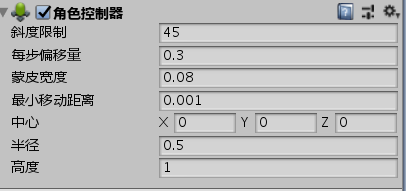

#角色控制器



只要加了角色控制器就会给这个对象加上一个胶囊体

##属性

Slope Limit ： 坡度限制 ---- 角色爬坡的最大角度

Step Offset ：每一步偏移量

Skin Width ： 皮肤值 ---- 一般是半径的 10%  控制双方嵌入深度

Min Move Distance ：最小移动距离

移动一般选择simpleMove

```
private CharacterController cc;
    private float speed;
    // Start is called before the first frame update
    void Start()
    {
        cc = GetComponent<CharacterController>();
        speed = 50f;
    }

    // Update is called once per frame
    void Update()
    {
        //cc.Move()  不会模拟重力效果SimpleMove 会伴随重力变化

        cc.SimpleMove(transform.forward * speed * Time.deltaTime * Input.GetAxisRaw("Horizontal"));
    }
```

注意：使用角色控制器要使用本地坐标系
