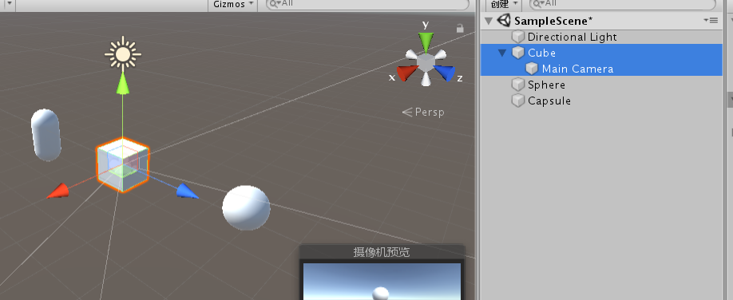
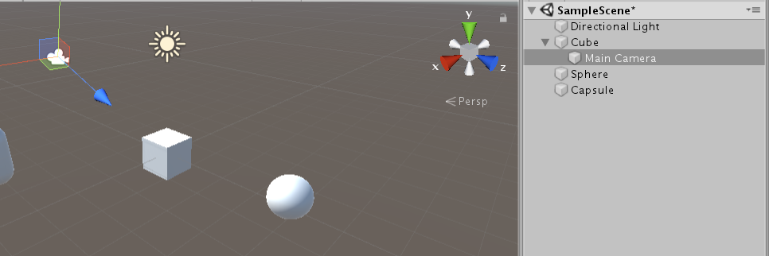
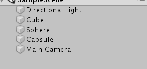

#人称

##第一人称
###方法一

将camera托到某个对象上面，使得camera是这个对象的子对象
使得相机的x，y，z和这个对象的x，y，z相等。



##第三人称

###方法一

将camera托到某个对象上面，使得camera是这个对象的子对象
使得相机的x，y，z和这个物体保持一定距离。

camera和游戏对象围绕同一个local旋转



ws控制前后，ad控制方向
```
    void Update()
    {
        transform.Translate(Vector3.forward * speed * Time.deltaTime * Input.GetAxisRaw("Vertical"));
        transform.Rotate(Vector3.up, Input.GetAxisRaw("Horizontal") * Time.deltaTime * angleSpeed);
    }
```

但这样只能看到物体的一个面，在很多游戏里面比如魔兽世界，是可以看到人物的正面，摄像机只跟着移动但不跟着旋转。

跟随物体移动，但不跟随旋转，并且有延迟效果



```
using System.Collections;
using System.Collections.Generic;
using UnityEngine;

public class CubeMove : MonoBehaviour
{
    private float speed;
    private float angleSpeed;

    private Camera mainCamera;
    // Start is called before the first frame update
    void Start()
    {
        speed = 1f;
        angleSpeed = 5f;
        mainCamera = Camera.main;
    }

    // Update is called once per frame
    void Update()
    {
        transform.Translate(Vector3.forward * speed * Time.deltaTime * Input.GetAxisRaw("Vertical"));
        transform.Rotate(Vector3.up, Input.GetAxisRaw("Horizontal") * Time.deltaTime * angleSpeed);
    }

    void LateUpdate()
    {
        mainCamera.transform.position = Vector3.Lerp(mainCamera.
            transform.position,
            transform.position + new Vector3(0, 2, -5),
            Time.deltaTime);
    }
}

```


##Unity中Update，FixedUpdate，LateUpdate的区别

摘抄与 https://www.cnblogs.com/dlyedu/p/7648463.html

void FixedUpdate () 固定更新

void Update ()        更新

void LateUpdate()  晚于更新

###void FixedUpdate () 和void Update () 
同：当MonoBehaviour启用时，其在每一帧被调用。都是用来更新的

异：Update()每一帧的时间不固定，即第一帧与第二帧的时间t1和第三帧与第四帧的时间t2不一定相同。FixedUpdate()每帧与每帧之间相差的时间是固定的.

> Update受当前渲染的物体影响，这与当前场景中正在被渲染的物体有关（比如人物的面数，个数等），有时快有时慢，帧率会变化，Update被调用的时间间隔就会发生变化。但是FixedUpdate则不受帧率的变化影响，它是以固定的时间间隔来被调用。

> 所以一些物理属性的更新操作应该放在FxiedUpdate中操作，比如Force，Collider，Rigidbody等。外设的操作也是，比如说键盘或者鼠标的输入输出Input，因为这样GameObject的物理表现的更平滑，更接近现实。

> FixedUpdate的时间间隔可以在项目设置中更改，Edit->Project Setting->time 找到Fixed timestep。就可以修改了


###void Update () 和void LateUpdate()

>LateUpdate是在所有Update函数调用后被调用。可用于调整脚本执行顺序。例如:当物体在Update里移动时，跟随物体的相机可以在LateUpdate里实现。
> Unity后台主线程将 Update LateUpdate  制作成两个多线程 先去执行Update的线程，等Update 执行完毕后 在去执行LateUpdate线程。
> 举个例子，一个宿舍4个人，每个人的起床在update中执行，出发在某个人中的lateupdate执行，这样就可以保证每个人都起床了才会出发。

>因为多个update函数是先后顺序是随机的，所以可能摄像机先update而物体还未移动，而下一帧是若物体先update那么就会出现瞬移的情况。多数摄像机都要加上LateUpdate，即所有场景内的调用结束后再更新摄像机。

>比如说：有2个不同的脚本同时在Update中控制一个物体，那么当其中一个脚本改变物体方位、旋转或者其他参数时，另一个脚本也在改变这些东西，那么这个物体的方位、旋转就会出现一定的反复。如果还有个物体在Update中跟随这个物体移动、旋转的话，那跟随的物体就会出现抖动。 如果是在LateUpdate中跟随的话就会只跟随所有Update执行完后的最后位置、旋转，这样就防止了抖动。


##插值Lerp

一般第三个填 Time.deltaTime

插值是根据Lerp(a,b,t)中的第三个参数t来返回a和b之间的值如果t是变化的，比如Time.time，则在一秒之内从a变化到b。
