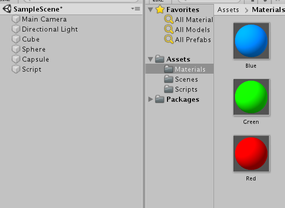

#射线

> 在游戏逻辑上发射一条射线，用于和物体碰撞。
> 在游戏时是看不到这个射线的。
> 例如鼠标点击抓取物体，鼠标检测应用等。

##鼠标点击

> 以屏幕上的鼠标为原点，向三维世界发射一条射线，这条射线与那个物体碰撞就认为鼠标点了哪个物体

```
void Update()
    {
        if (Input.GetMouseButton(0))
        {
            print(Input.mousePosition);
            Ray ray = Camera.main.ScreenPointToRay(Input.mousePosition);

            RaycastHit hit;
            if (Physics.Raycast(ray,out hit,100f)) //输出参数输出碰到的物体
            {
                lineRenderer.enabled = true;
                //设置射线位置
                lineRenderer.SetPosition(1, hit.point);//1表示结束位置,直接设置成碰撞点
            }
            else
            {
                lineRenderer.enabled = false;//关闭射线
                //lineRenderer.SetPosition(1, new Vector3(0, 0, 100));//没有碰到
            }
        }
    }
```


##例程
###点击到的物体被销毁

```
    void Update()
    {
        if (Input.GetMouseButton(0))
        {
            print(Input.mousePosition);
            Ray ray = Camera.main.ScreenPointToRay(Input.mousePosition);

            RaycastHit hit;
            if (Physics.Raycast(ray,out hit,100f)) //输出参数输出碰到的物体
            {
                Destroy(hit.collider.gameObject); // collider 是碰撞体 通过碰撞体得到游戏对象
            }
        }
    }
```


Physics.Raycast() 第四个参数 图层

先按照不同图层将物体分开



如果我像拿到编号为9的那一层，那么点击的射线只对该层物体有效
如果要得到所以的图层，那么这个参数可以不写


代码应该为

`Physics.Raycast(ray,out hit,100f,1<<9)`

9 和 blue层
`Physics.Raycast(ray,out hit,100f,1<<9 | LayerMask.GetMask("blue"))`


