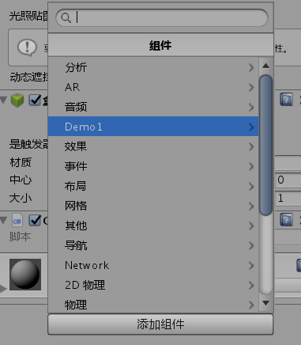
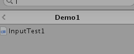
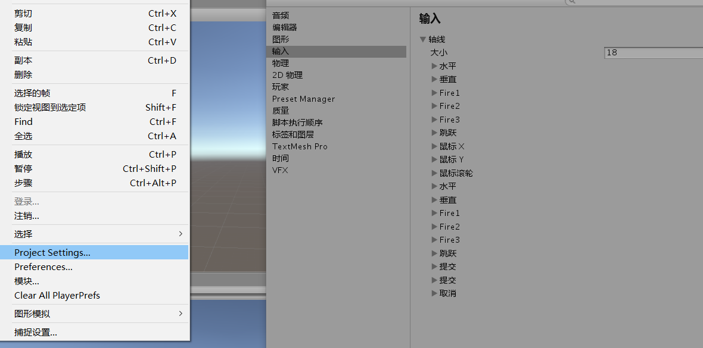
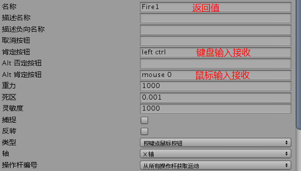
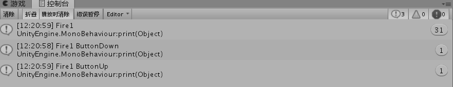

#输入

##Button

添加特性，脚本逻辑菜单名
`[AddComponentMenu("Demo1/InputTest1")]` 









```
void Update()
    {
        if (Input.GetButton("Fire1"))
        {
            print("Fire1");
        }
        if (Input.GetButtonDown("Fire1"))
        {
            print("Fire1 ButtonDown");
        }
        if (Input.GetButtonUp("Fire1"))
        {
            print("Fire1 ButtonUp");
        }
    }
```

当我按下左键 大概1s在松开

输出：



Down和Up只是在变化时输入，而GetButton每一帧都检测是否按下


##Axis

```
transform.Translate(Vector3.right * Input.GetAxisRaw("Horizontal") * speed * Time.deltaTime);
//这句是调用，GetAxisRaw标准输入来得到键盘输入的，其等效方法如下


   if (Input.GetKey(KeyCode.A))
   {
       transform.Translate(Vector3.left * speed * Time.deltaTime);
   }
   else if (Input.GetKey(KeyCode.D))
   {
       transform.Translate(Vector3.right * speed * Time.deltaTime);
   }
```

关于Vector3 的对象，都是单位向量

Up  ---- (0,1,0)
Left ---- (-1,0,0)
One ----(1,1,1)
Zero ----(0,0,0)
......

向量支持的运算符：` -	!=		*	/	+	==`


##关于增量时间Time.deltaTime

假设让一个物体每秒运动10m 我们一般这么写
```
 void Update()
    {
        transform.Translate(0, 0, Time.deltaTime * 10); //物体沿着自身Z轴方向，每秒移动物体10米运动
    }
```

###为什么要乘以增量时间？：

我们假设游戏运行时，1秒是60帧。那就是说60个画面，每一帧调用一次Update()方法。
那么没一帧移动 10 * （1/60） 约等于  0.167m

如果游戏帧数不稳定，比如到了30帧
那么如果还是移动0.167m的话就只移动了5m，这和我们期待的10m就相差较大了

所以要乘上增量时间

**增量时间是实时变动的，而且每一帧都在变动**

1秒30帧，那增量时间就是 1/30 秒
1秒60帧，那增量时间就是 1/60 秒
1秒166帧，那增量时间就是 1/166 秒

就保证了无论帧率是多是少，我们让物体1秒移动10米，最后1秒移动的就一定是10米


**三个属性的方法:**

名字|属性|方法
--:|--:|--:
位置|position|Translate()
旋转|-|Rotate(),RotateAround()
缩放|localScale|-

四元数：解决三维坐标系中物体旋转的问题。相当于一个Vector4 --- （x,y,z,w）

旋转的物体要按照local坐标系上的轴旋转

`transform.rotation = Quaternion.AngleAxis(30, Vector3.Up);`

Vector3.Up 是某个平面的法向量
30：是要转动的角度


##变换


