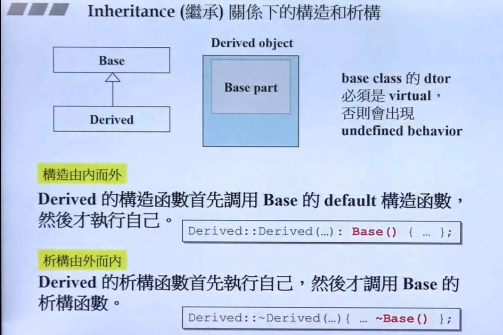
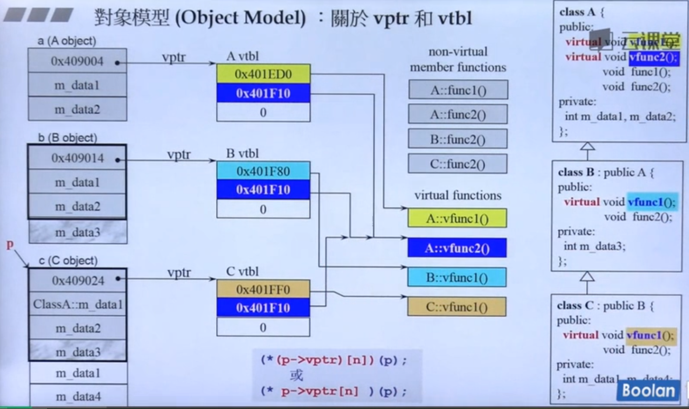

#C++进阶
##复合继承下的析构和构造


##继承和多态的原理--vptr和vtbl



如图
B继承了A
C继承了B

子类的对象有父类的成分
当一个类有虚函数的时候
类里面就会多一根指针 `vptr`
每一个类都会有一个 `vtbl` 里面放的是虚函数的函数指针
**这个虚指针 vptr会指向 虚函数表  vtbl**

所谓继承会继承父类的数据(data)
也会把函数继承下来(也就是继承了函数的调用权)


图中 A有两个虚函数vfunc1() 和 vfunc2()
B继承了A之后推翻了 vfunc1() 但还是会有A的 vfunc2()
虽然B的func2() 和 A的 func2() 同名但不会去调用A的 func2()
C继承了B C再次推翻了B的vfunc1() 并且继承了B的 vfunc2()

vptr 只会关联到**虚函数**和一般的函数没有关系


##const 关键字

const 关键字能增加程序的健壮性
**能使用const的时候一定要使用const**

如果一个成员函数没有改变类里面的成员变量的值就一定要加上const
例如
```
class MyString{
public:
		print()/*const*/{
			//...
		};
private:
	//......
};
```
这个类中print没有加上const
使用者如果如下使用
```
const MyString str("hello world");
str.print();//这里，编译器会报错
```
因为成员函数print()没有加上const 意味着可能改变类成员的值
又因为str对象创建时加上了const 但print()不保证不改变其值

有无加const 在函数签名中算不同函数
const算函数签名的一部分

##Dynamic Binding

在之前的继承关系中
动态绑定发生只有基类指针指向子类对象
```
A* p = new B;
p = &b;//基类指针指向子类对象
p->vfunc1();
```
此时发生了多态调用

##New 和 Delete

new和delete的行为是：
先调用ctor和dtor
在调用 `operator new` 和 `operator delete`
而全局函数
`::operator new` 和 `::operator delete`
只是调用了`malloc` 和`free`
我们一般不会重载全局的new和delete
因为它的影响很大

```
//成员函数new delete的重载
class Foo{
	int _id;
	long _data;
	string _str;
public:
	Foo():_id(0){}
	Foo(int i):_id(i){throw bad();}
public:
	~Foo(){}
	void* operator new(size_t size){
		Foo p = (Foo*)malloc(size);
		//.....
		return p;
	}
	
	void* operator new(size_t size，void* start){
		//.....
		return start;
	}
	void* operator new(size_t size，long extra){
		Foo p = (Foo*)malloc(size + extra);
		//.....
		cout << extra << "   "<< start << endl;
		return p;
	}
	void* operator new(size_t size，long extra ,char start){
		Foo p = (Foo*)malloc(size + extra);
		//.....
		cout << extra << "   "<< start << endl;
		return p;
	}
	
	void operator delete(void* pdead, size_t size){
		//...
		cout << size;
		free(pdead);
	}
	//...与new对于的4个operator delete 
};
```

我们可以重载很多成员operator new() 
但每一个版本的声明的参数列不能是一样的
其中**第一个参数必须是 `size_t `**

使用者使用
`Foo* p = new (300,'c')Foo;//编译器会去调用void* operator new(size_t size，long extra ,char start)`


