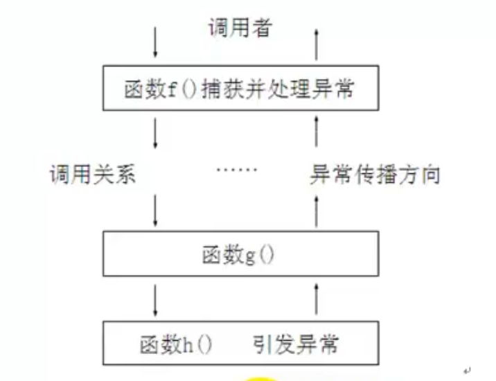

#C++进阶 day04

##C++的类型转化

**c++类型转化的统一格式 **

`TYPE b = static_cast<TYPE>(a);`

###四种类型转化
`static_cast` 静态类型转化
`reinterpret_cast` 重新解释类型
`dynamic_cast` 动态类型转化，用于父子类型多态类型转化
`const_cast` 去除`const`属性

###static_cast
静态转化时c++编译器会做类型检查有错误会提示错误
c语言里面可以进行隐式类型转化的一般都可以使用static_cast

```
double pi = 3.1415926;
int num = static_cast<int>(pi);
```

**不适合的：**

类似于 char* ==> int* //这种指针类型的重新解释编译器会报错
```
char* p = "hello";
int* p2 = static_cast<int*>(p);//error:无法从char*转化成int*
```

###reinterpret_cast
强制类型解释
```
char* p = "hello";
int* p2 = reinterpret_cast<int*>(p);
```
这里是可以编译通过的

###dynamic_cast
动态类型转化

能在运行时进行类型识别
```
class Tree{};

class Animal{
public:
	virtual void cry() = 0;
};
clss Dog:public Animal{
public:
	virtual void cry(){
		cout << "wangwang!" << endl;
	}
	void other(){
		cout << "看家" << endl;
	}
};
clss Cat:public Animal{
public:
	virtual void cry(){
		cout << "miaomiao!" << endl;
	}
	void other(){
		cout << "吃鱼" << endl;
	}
};
void playobj(Animal* base){
	base->cry();//基类指针指向子类对象(多态)
	//需求：能识别子类对象类型
	Dog* pd = dynamic_cast<Dog*>(base);//父类对象转成子类对象，向下转型，如果转化识别会返回NULL
	if(pd != NULL){
		pd->other();//类型特有的动作
	}
	Cat* pc = dynamic_cast<Cat*>(base);
	if(pc != NULL){
		pc->other();//类型特有的动作
	}
}
void main(){
	Tree t1;
	Dog d1;
	Cat c1;
	Animal* pbase;
	pbase = &d1;
	pbase = static_cast<Animal*>(&d1);
	pbase = static_cast<Animal*>(&t1);//c++编译器会报错
	pbase = reinterpret_cast<Animal*>(&t1);//这里c++编译器会通过，这个类型转化是重新解释类型
	playobj(&d1);
	playobj(&c1);
}
```

###const_cast
去除const属性
可以通过指针修改const内存空间
但要确保该内存空间是可以修改的
否则会带来不可预期后果
```
void print(const char* p){
	char *p1 = NULL;
	p1 = const_cast<char*>(p);
	p1[0] = 'z';//通过p1修改了内存空间
	cout << p << endl;
}
```

**类型转化须知：**
**要清楚转化前和转化后的类型**
**要知道转化后发生的后果**
**要选择合适的语法进行转化**


##异常处理

###基本语法
抛异常
通过throw创造一个异常对象抛出
```
void func(){
	//...
	throw 表达式
	//...
}
捕获异常
try{
	func();//可能抛出异常的程序块
}
catch(异常类型声明){
	//...
}
catch(异常类型(形参)){
	//...
}
```

* 异常会一层一层往上抛出
* 直到某个位置处理这个异常
* 接收异常之后可以不处理继续向上抛出
* 如果没有任何位置处理异常
* 会引起程序的中断
* 捕获异常的时候是按照类型捕获的

```
//发生异常后会跨越函数
void divide(int x,int y){
    if(y == 0){ 
		throw x;//抛出异常后后面的语句不执行了
    }   
    cout << x/y << endl;
        
}
void mydivide(int x,int y){
	try{
		divide(x,y); 
	}
	catch(...)//未知类型异常
    {
		cout <<"未知类型异常\n";
		throw;//不能处理的异常再次向上抛
    }
}
int main(){
        
    try{
		mydivide(100,0);
    }   
    catch(int e){ 
		cout << e << "不能被0除" << endl; 
    }   
      
    return 0;
}   
```

//异常机制和函数不冲突
//捕获异常是按照类型匹配的
```
try{throw 'z'}
catch(int e){
	cout << e << endl;
}
catch(...){
	cout << "未知异常类型" << endl;
}
//这样是捕获不到异常的
```

异常处理的基本思路



这里的h()函数可以只关心业务的实现不关心异常的处理
这样异常的引发和处理可以写在不同的函数中

###栈解旋
进入到try语句的所有的语句在栈上分配的所有变量
在发生异常的时候会把这些变量全部析构


###异常接口声明
在函数声明中
`void func()throw (A,B,C,D)//这个函数fucn()只能抛出A B C D及其子类型的异常`
如果不写会抛出任何类型的异常
如果括号内()为空则该函数会抛出异常
```
void mydivide(int x,int y) throw(int,char,char*){
	//....
}
```
如果抛出其他类型的异常，c++编译器会报错

###异常变量的声明周期

1. 如果接受异常时使用变量，则拷贝构造异常常量
2. 使用引用的话，会直接使用throw的那个变量	引用和变量不能同时出现
3. 如果抛出指针类型，接受也要用指针，因为异常是按照类型匹配的
	且抛出异常时要动态分配内存，在接收异常时要删除指针防止内存泄漏
	
**用引用来传递异常是最吼的**


###标准异常库

演示：
```
class Teacher{
public:
	Teacher(int age){
		if (age > 100){
			string  s = "年龄太大";
			throw out_of_range(s);
		}
		this->age = age;
	}
protected:
private:
	int age;
};
void main61(){
	try{
		Teacher t1(102);
	}
	catch (out_of_range e){
		cout << e.what() << endl;
	}
	exception e;
	system("pause");
}
```

##输入输出流

ios以及其派生类直接构成了菱形继承
关于菱形继承的问题可以看该博客

https://www.cnblogs.com/duwenxing/p/7492247.html

###关于cin对象

如果有一个数组，输入时遇到空格会终止，cin是不接受空格的
```
void main(){
	char	mybuf[1024];
	int		myInt;
	long	myLong;
	cin >> myInt;
	cin >> myLong;
	cin >> mybuf; // 遇见空格停止接受 数据 
	cout << "myInt:" << myInt << "myLong" << myLong << "mybuf:" << mybuf << endl;
	//假如输入aaa bbb ccc
	//只会打印aaa
	system("pause");
}
```
标准输入流对象cin
	`cin.get()` //一次只能读取一个字符
	`cin.get(一个参数)` //读一个字符
	`cin.get(三个参数)` //可以读字符串
	`cin.getline()`
	`cin.ignore()`//忽略cin.ignore(2)忽略两个字节
	`cin.peek()`	//窥视看缓冲区里面有没有内容，只看不接，返回第一个字节的内容，如果没有内容则阻塞
	`cin.putback()`


当我们输入时，从键盘输入到缓冲区
cin对象从缓冲区中拿出数据存入内存
如果缓冲区没有数据程序会阻塞
`cin.get()`函数会获取缓冲区内的数据，如果不能取出全部内容
下次调用`cin.get()`会继续获取数据
EOF == Ctrl键+z
```
char a, b, c;
cin.get(a);
cin.get(b);
cin.get(c);
//cin.get(a).get(b).get(c);
```
之前说过cin << 读取到空格后就不会继续读了
如果一行字符有空格可以使用
`cin.getline()`来接收这个字符串


```
char buf1[256];
char buf2[256];
cin >> buf1;
cin.getline(buf2, 256);//内存地址，内存大小(字节)
cout << "buf1:" << buf1 << "buf2:" << buf2 << endl;
```
输入两次aa bb cc 打印出
buf1:aa buf2: bb cc
buf2把aa后面的空格打印出来了
aa之后的所有字符被`cin.getline()`接收了


###标准输出cout

输出流的控制格式

作用|格式控制成员函数|预定义格式控制函数|预定义格式控制符/操作子|效果持续
--|--:|--:|--:|
进制|`flags() setf() unsetf()`|`setiosflags()`|dec oct hex showbase|能持续
宽度|`width(n)`|`setw(n)`|-|不能持续
对齐|`flags() setf() unsetf()`|	`setiosflags()`|`right left internal`|能持续
填充|`fill(c)`|`setfill(c)`|-|能持续
精度|`precision(n)`|`setprecision(n)`|-|能持续


###文件读写
```
ofstream fout("c:/2.txt");//输出流对象
if(fout == 0){//如果返回0 则打开失败
	cout << "open file failed！\n"
}
fout << "hello" << endl; //往文件里面写东西
```
```
char ch;
ifstream fin("c:/2.txt");//输入流对象
while(fin.get(ch)){cout << ch;} // 读取每一个字符
fin.close();//关闭输入对象
```

###对二进制文件的读写(存储对象文件)

```
class Teacher{
public:
	Teacher():age(33){stpcpy(name,"");}
	Teacher(int _age,char* _name){age = _age; strcpy(name,_name);}
	void print(){
		cout << "age:" << age << "name:" << name << endl;
	}
private:
	int age;
	char name[32];
};
void main(){
	char * fname = "c://11a.dat";
	ofstream fout(fname,ios::binary);
	if(fout == 0){
		cerr << "open file failed!\n";
		return;
	}
	Teacher t1(31,"t1");
	Teacher t2(32,"t2");
	fout.write((char*)&t1,sizeof(t1));
	fout.write((char*)&t2,sizeof(t2));//存入二进制文件
	fout.close();
	ifstream fin(fname);
	Teacher tmp;
	
	fin.read((char*)&tmp,sizeof(Teacher));//读取并解释成Teacher类
	tmp.print();
	fin.read((char*)&tmp,sizeof(Teacher));
	tmp.print();
	fin.close();
}

```

