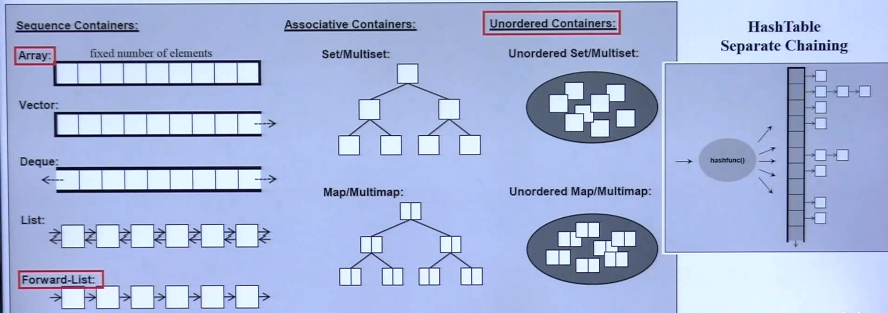
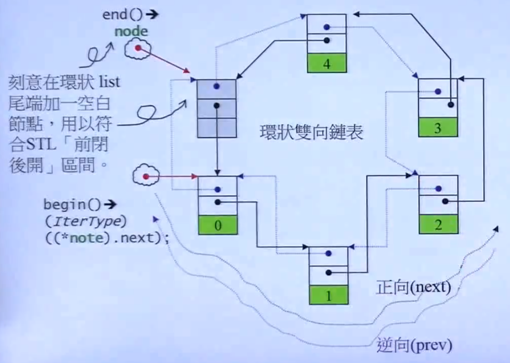
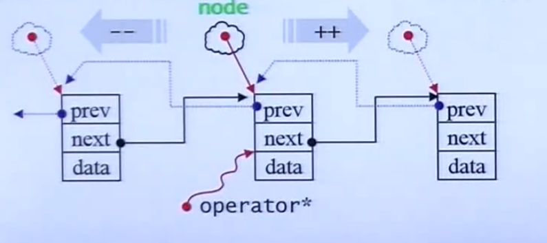
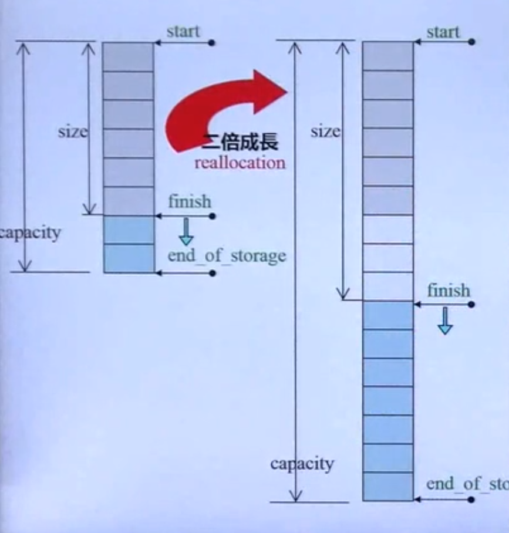
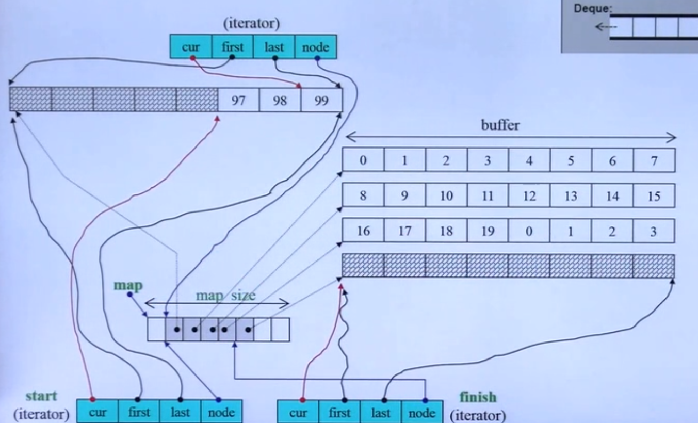
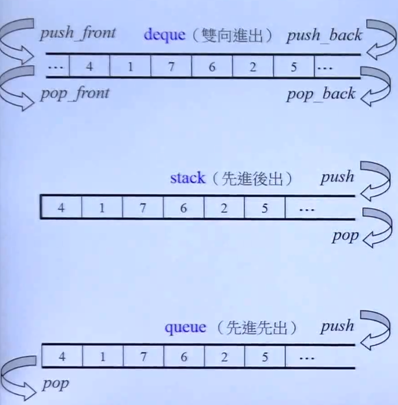

#STL泛型编程 day01

##GP的介绍
C++标准库不是使用的面向对象(OOP)来设计的
使用的是泛型编程(GP)

**OOP与GP的区别：**

* OOP试图将datas 和 methods 关联在一起

* GP 试图将datas 和 methods 分开
datas 和 methods之间使用迭代器(iterator)来建立关系

标准库容器一览



##分配器 allocator
一般我们不会直接去用分配器，分配器一般是给容器使用的
分配器的效率直接影响容器的效率(速度和空间都有)

先谈 operator new() 和 malloc()


如图我们 malloc(size) malloc会附加一些其他的成分到分配的内存中
它会进行一些额外的开销
如果size大那么额外开销就会相对变小
如果size小那么额外开销就会相对变大
所以我们要尽量减少malloc的次数，因为每次都会有一些额外开销
我们尽量一次性拿到尽量多的内存(size)

标准库中的allocator 会一层一层地分配下去最终会调用malloc


##list



标准库中的list是一个双向链表
图中灰色的部分是不可访问的
在最后的一个结点是不能访问灰色结点的

结点设计

```
struct _List_node_base{
	_List_node_base* _M_next;
	_List_node_base* _M_prev;
};
```

```
_List_node会去继承_List_node_base
template<class _Tp>
struct _List_node:public _List_node_base{
	_Tp _M_data;
};
```



list的迭代器的++行为会找到next指针域的值，指向下一个结点
()*)操作符会取出data的引用，(->)操作符会取出data的指针


##vector的增长规律



如图我们有一个vector容器它的大小为size，总容量为capacity，finish为它的元素的最后位置
end_of_storage是它的容量的最终位置

如果我们再向这个容器里面添加3个元素，那么就必定会超过整个容器的大小capacity
那么vector会去内存中找到一个位置能存放2倍的capacity大小的空间，然后把数据拷贝过去

每次vector成长都会大量地拷贝/析构元素


##deque,queue和stack

`deque`相当于两端都可以增长的vector



它的实现方式是分段后把它串接起来

图中的5个缓冲区被串起来，来模拟双向
如果我们在放元素，后方扩充时，deque会在后方创建缓冲区
如果我们头插元素，向前扩充时或创建缓冲区，并把元素从后向前放置

###deque的迭代器

里面有4根指针 cur first last node
node 指向控制中心map下面的某一个缓冲区
first 和 last指向node所中的缓冲区的头和尾
当deque的迭代器后移到边界时会跳到下一个缓冲区的头部
迭代器维持了连续的假象，迭代器有能力在缓冲区中跳转
cur指的元素就是迭代器指向的元素

map是一个二维指针它指向了缓冲区列表

deque容器类中有两个迭代器
start和finish
start指向头元素的首地址
finish指向最后一个元素的下一格的首地址

###deque模拟连续空间：
deque的operator-()
先根据map计算迭代器之间的缓冲区的个数n
在计算当前所指缓冲区的元素个数m

n*BUFERSIZE+m == 差值(两个迭代器之间的元素个数)

迭代器的++和--操作符重载

每次移动都要检查是否到边界
后边界要移动到下一个缓冲区的头部
头边界要调到上一个缓冲区的尾部
退回控制中心map，找出下一个缓冲区

###stack和queue



这两个容器中不需要自己实现底层操作功能
只要去除deque的一些功能和自己定义一些方法就可以实现
stack和queue内部都有一个deque

