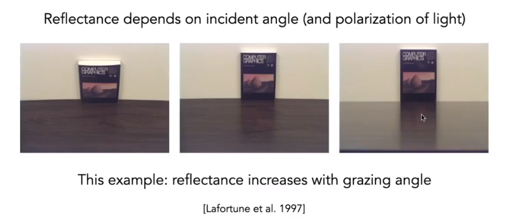
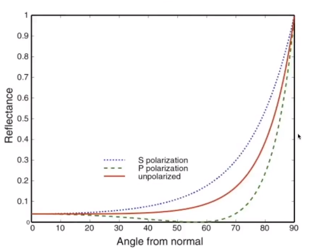
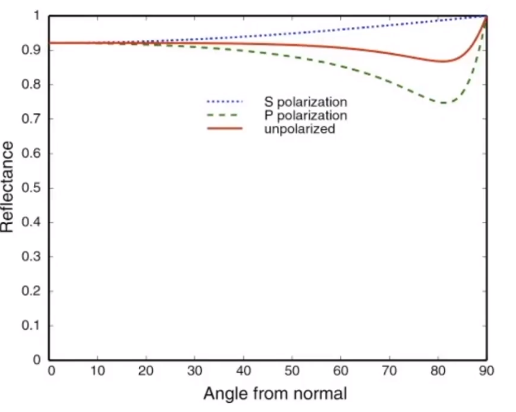
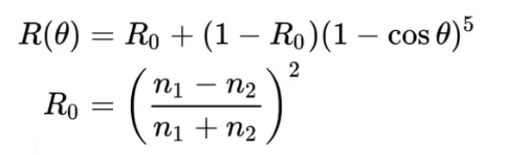
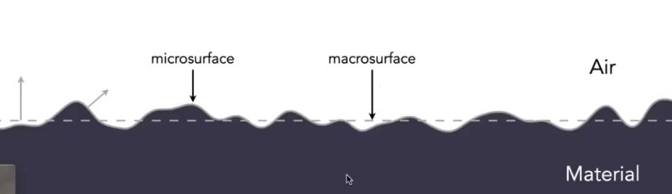
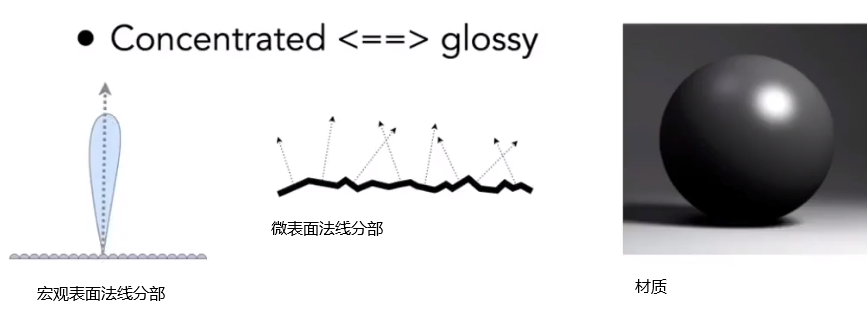
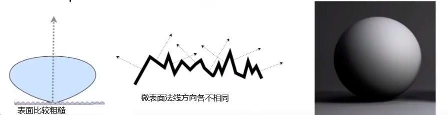
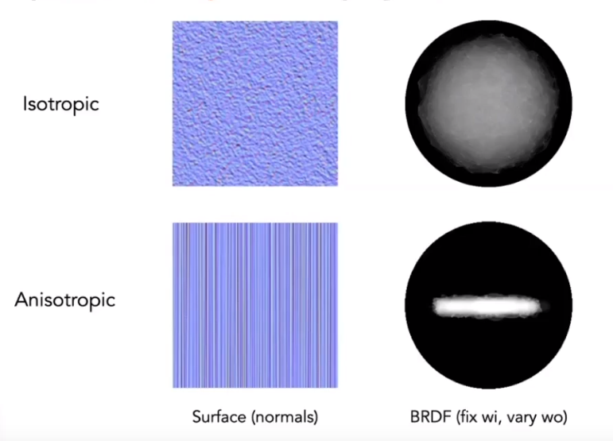
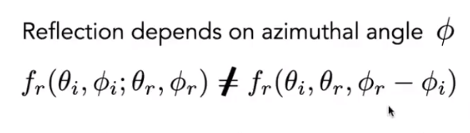

##折射和反射

##菲涅耳

如图桌子上的书立在上面
我们近乎垂直地往前看，那么我们看不到多少反射光（书反射到桌子上再反射到眼睛里）
如果近乎水平地看那么就能看多很多反射光
也就是说入射光与法线的角度决定了有多少光能被反射

入射光的角度与法线几乎平行那么就没有多少能被反射
入射光角度与法线垂直那么很多光线就会被反射

对于非金属材质菲涅耳系数如下图(玻璃，水。。。)

对于金属材质（镜子，铜，铁。。。。）

菲涅耳的拟合公式 n1 n2 是两个物体的折射率(常数) 通常情况下这个近似公式够用

##微表面模型(Microfacet Material)

> 当我们离物体比较远时，这个物体表面形成的微小的光线传播我们很难看见。我们只能看见它们形成的，对物体表面形成的一个综合的作用。

> 我们理解漫反射：微表面上的微元形成的镜面反射把光线反射到四面八方。所有的微表面可以理解成一个很小的镜子。

> 微表面作用下，所有微元的表面法线会形成一个分部。

> 第一项是菲尼尔系数，决定了多少光线能被反射
> 第三项法线分部，表示了在任何给定方向上法线分部的值，当half vector(**h**)，和一个微表面的法线一致时才能反射出去 
> 这个项告诉了我们在这个方向有多少个微表面能反射。
> 第二项，几何项，微表面可能会发生互相遮挡。在光线几乎和面平行时考虑（Grazing Angle）
> 假如你有一个漫反射材质的球,由于菲涅耳和法线分部在球的边缘部分可能会很亮，

##材质分类

> 我们把材质分为两类
> 1 各项同性材质：各个微表面不存在方向性
> 2 各项异性材质：微表面法线分部有明确的方向性

在某个入射光的BRDF为fr 他在在方位角上旋转后得到的fr不同即各向异性材质

