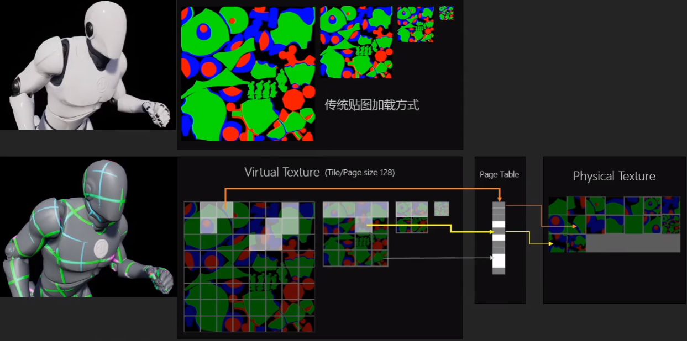

virtual texture

参考：https://zhuanlan.zhihu.com/p/138484024

Software Virtual Texture：

> 传统贴图加载方式：近处的物体加载分辨率较高的mipmap（层数较低），远处的物体（一个像素占比较多）加载分辨率较低的mipmap（层数较高）
> svt会吧普通的贴图分成不同的page(默认128*128) 根据是否需要被渲染，来决定是否加载到内存里面去。

如何地址映射

**1 四叉树**

每一个贴图对应4个mipmap 那么就可以每个高层点对应4个低层点了。首先当某个像素需要被渲染时加载这个点对应的mipmap，如果需要往低层找那么直接找到这4个子节点，如果没有载入的话就先用高层节点代替。

