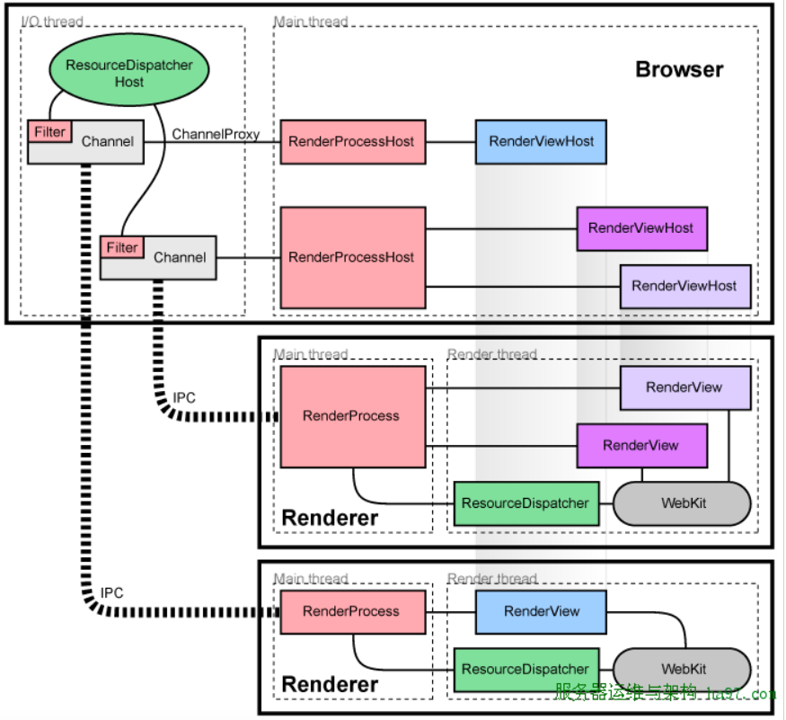
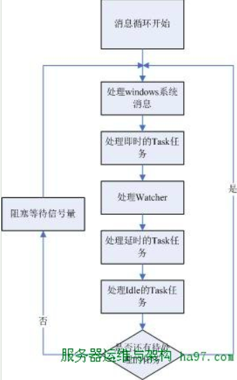

# 整体架构分析

##架构框图

##进程模式

1. Process-per-site-instance：就是你打开一个网站，然后从这个网站链开的一系列网站都属于一个进程。这是Chrome的默认模式。
2. Process-per-site： 同域名范畴的网站放在一个进程，比如www.google.com和www.google.com/bookmarks就属于一个域名内（google有自己的判定机制），不论有没有互相打开的关系，都算作是一个进程中。用命令行–process-per-site开启。
3. Process-per-tab：这个简单，一个tab一个process，不论各个tab的站点有无联系，就和宣传的那样。用–process-per-tab开启。
4. Single Process：这个很熟悉了吧，传统浏览器的模式，没有多进程只有多线程，用–single-process开启。

对于Render进程它通常有两个线程：
1. **MainThread**：它和主进程通信
2. **Render thread**：它们负责页面的渲染和交互

> 在此之下有负责与各Renderer帮派通信的IO thread
> 负责管文件的file thread
> 负责管数据库的db thread等 
> 详情见谷歌官方文档http://sites.google.com/a/chromium.org/dev/developers/design-documents/threading

##线程模型

> chrome的线程模型，将锁限制了极小的范围内（仅仅在将Task放入消息队列的时候才存在…），并且使得上层完全不需要 关心锁的问题（当然，前提是遵循它的编程模型，将函数用Task封装并发送到合适的线程去执行…），大大简化了开发的逻辑。

Chrome的线程，入口函数都差不多，都是启动一个消息循环（参见MessagePump类），等待并执行任务。

处理IO等线程启用的是MessagePumpForIO类
处理UI等线程启用的是MessagePumpForUI类
一般的线程用到的是MessagePumpDefault类

在上图中不是所以线程都需要完整跑一个循环

|MessagePumpDefault|MessagePumpForIO|MessagePumpForUI|
--:|--:|--:|--:|
是否需要处理系统消息|否|是|是
是否需要处理Task|是|是|是
是否需要处理Watcher|否|是|否
是否阻塞在信号量上|否|是|是

