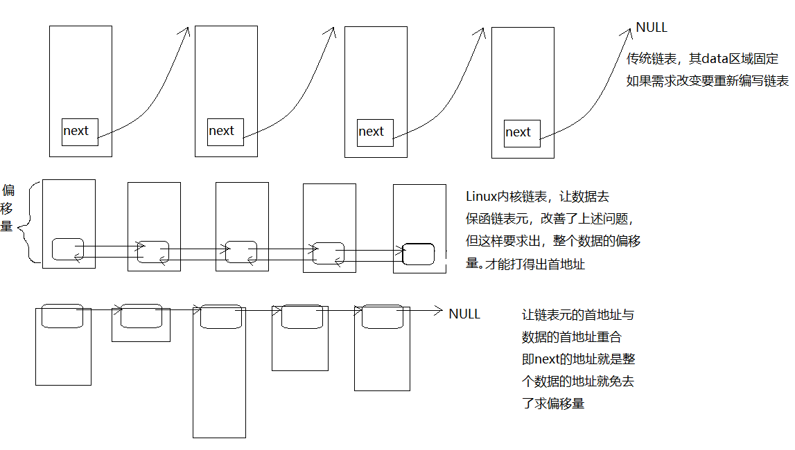

#数据结构 day01
[**本章源码下载**](code/da1.rar)
##线性表

###线性表的顺序存储

线性表的顺序存储：`seqList`
类似于数组创建时必须给定大小

**优点：**无需为线性表中的逻辑关系增加额外空间  可以快速获取合法位置的元素
**缺点：**插入和删除需要大量移动元素  长度大小不能改变

###接口定义
```
#pragma once
typedef void List;
typedef void ListNode;
typedef struct Seq_List {
	int lenth;	//长度
	int cap;	//容量
	unsigned int *node;
}TSeqList;
List* SeqList_Create(int cap);
void SeqList_Destroy(List* list);
void SeqList_Clear(List *list);
int GetListLenth(List *list);
int GetListCap(List *list);
int SeqList_Insert(List* list, ListNode* node,int pos);
List* SeqList_Get(List* list, int pos);
ListNode* SeqList_Delete(List* list, int pos);
int SeqList_GetLenth(List* list);
```

###线性表的链式存储：`LinkList`

**不同之处**
```
LinkList_Insert
LinkList_Delete
```
```
int LinkList_Insert(List* list, LinkListNode* node, int pos) {
	if (list == NULL || node == NULL || pos < 0) {
		fputs("error input from LinkList_Insert\n", stderr);
		return -1;
	}
	TLinkList* tmplist;
	LinkListNode* current;//辅助指针变量
	tmplist = (TLinkList* )list;
	current = &(tmplist->header);
	for (int i = 0; i < pos; i++) {
		current = current->next;
	}
	node->next = current->next;
	current->next = node;
	tmplist->lenth++;
	return 0;
}
```
```
LinkListNode* LinkList_Delete(List* list, int pos) {
	if (list == NULL || pos < 0) {
		fputs("error input from LinkList_Delete\n", stderr);
		return NULL;
	}
	TLinkList* tmplist = NULL;
	tmplist = (TLinkList*)list;
	LinkListNode* current = &tmplist->header;
	for (int i = 0; i < pos; i++) {
		current = current->next;
	}
	LinkListNode* tnode = NULL;
	tnode = current->next;
	current->next = tnode->next;
	tmplist->lenth--;
	return tnode;
}
```
