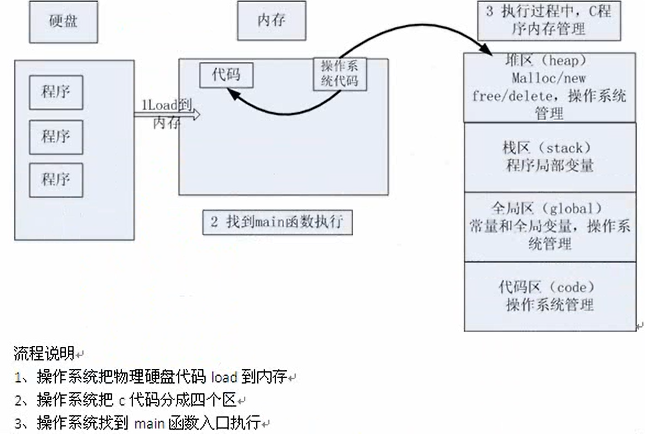
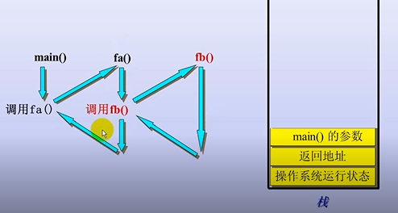

#C语言进阶 day01
##数组与指针
**函数传参时**

* 在形参中的数组编译器会处理它退化成一根指针
```
void func(int a[]，int len);//这里的a时一根指针
int main(){
	int a[5]={0};//这里的a是数组
	func(a，5);
}
```
在函数传参时把数组首地址和长度传给被调用函数

**本质：**

* 函数传参和原本的实参的数据类型不一样

##内存四区
**数据类型：**

1. 数据类型是对数据的抽象
2. 相同的数据类型有相同的表示形式、存储格式以及相关操作
3. 程序中所以的数据都属于一种类型


**数据类型的本质**

* 固定大小内存块的别名

**思考：**
```
int b[10];
printf("b:%d b:+1:%d &b:%d &b+1:%d \n",b,b+1,&b,&b+1);
 
```
结果为：
`b:1173678176 b:+1:1173678172 &b:1173678176 &b+1:1173678136`

分析：
* b代表首元素的地址
* &b代表整个数组的地址

**`void`关键字**

用法：
1. 数据类型的封装,例如：
	`int InitHardEnv(void** handle);`
	`void* memcopy(void *dest,const void *src,size_t len)`
2. `void`修饰返回值和参数表示无
3. `void`指针做右赋值时需要强制类型转换

**内存四区模型**




* 栈区：由编译器自动释放，存放函数的参数局部变量
* 堆区：由程序员分配释放，若不释放，程序结束时由操作系统回收
* 全局区：静态区(static): 初始化的全局变量，静态变量，未初始化的全局变量，未初始化的静待变量，放在另一款区域，由操作系统释放
* 常量区：字符串和其他常量储存位置，程序结束后由操作系统释放

[关于内存四区更详细的解释](extra.md)

* 指针指向谁就把谁的地址赋值给指针
* 指针变量和他所指向空间的变量是两个不同的概念
* **指针是一种数据类型，它指向的内存空间的数据类型**
   * 指针的步长 根据所指向的内存空间的类型来决定

**测试:**
栈的开口方向测定(向上或向下)
```
int a = 0;//a入栈
int b = 0;//b入栈
printf("&a:%p &b:%p \n",&a,&b);//打印ab的地址
```
结果:`&a:0x7ffdefc72f6c &b:0x7ffdefc72f68 `开口向下
测试机器:x64 阿里云主机 1核2G Linux  Centos7.4
 一般认为栈的开口方向向下
 
对于数组buf
当执行`buf++`buf的生长方向向上
这证明数组首元素的，地址在栈里面这个数组空间的最下面

**函数调用模型**


