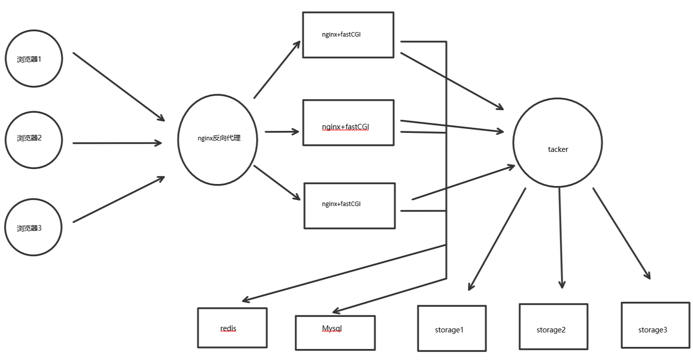

#项目整体方案设计

> 分布式网络云盘：使用nginx反向代理，nginx+fastDFS进行文件存储，nginx+fastCGI进行用户注册，上传下载等操作，数据库使用Redis+MySQL。

##项目框图

##nginx配置使用
[**传送门**](nginx.md)

##fastDFS配置使用
[**传送门**](fastdfs.md)

##fastCGI模块
[**传送门**](fastcgi.md)

##CGI程序编写
[**传送门**](code.md)

##MySQL建表
[**传送门**](mysql.md)

