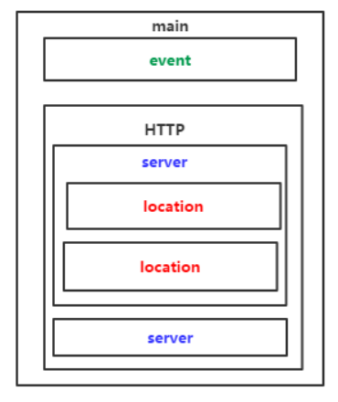

#nginx配置

> 安装完nginx后其配置文件的位置在/usr/local/nginx/conf/nginx.conf

开启nginx
/usr/local/nginx/sbin
sudo ./nginx

停止：
nginx -s stop
		立刻终止服务器
nginx -s quit
		等待当前操作处理完成之后再停止服务器
重新加载 nginx -s reload

相关资料：

官方文档：http://nginx.org/en/docs
阿里翻译：http://tengine.taobao.org/nginx_docs/cn/docs
配置文件讲解：https://www.cnblogs.com/bluestorm/p/4574688.html

##配置文件结构



其中

* main   全局设置
* server 主机设置
* location  url配置设置
* upstream 负载均衡


##配置文件

从上往下读
```
#user  nobody; #worker进程所属
worker_processes  1; # 工作进程数 
#pid        logs/nginx.pid; # pid文件
```

events对应事件

```
events {
    use epoll; # 使用epoll
    worker_connections  1024; # 连接最大个数
}
```
```

http {
    include       mime.types;
    default_type  application/octet-stream;
	
    sendfile        on;
    #tcp_nopush     on;

    #keepalive_timeout  0;
    keepalive_timeout  65; #连接保持时长

    #gzip  on;
    #一个server模块对应一个web服务器
    server {
        listen       80; #监听端口
        server_name  localhost; #服务器域名对应本机的ip

        #charset koi8-r;

        #access_log  logs/host.access.log  main;
        # 一个location就代表web服务器要处理的指令 静态页面
        location / { # / 代表资源根目录
            root   html; # 根目录的具体位置 html/ 代表静态网页
            index  index.html index.htm; #如果找不到第一个html就找第二个htm
        }
		location /second.html{
			root demo;
			index second.html;
		}
        #error_page  404              /404.html;

        # redirect server error pages to the static page /50x.html
        #
        error_page   500 502 503 504  /50x.html;
        location = /50x.html {
            root   html;
        }
    }
}

```


##反向代理

注意修改本地主机的hosts文件

```
upstream aaa.test{
		server 192.168.1.238:80;
	}
	
upstream bbb.test{
		server 192.168.1.223:80;
	}
	server{
		# 端口
		listen 80;
		# 域名
		server_name aaa.com;
		location / {
			# 设置代理
			proxy_pass http://aaa.test;
			
		}
	}
	server{
		# 端口
		listen 80;
		# 域名
		server_name bbb.com;
		location / {
			# 设置代理
			proxy_pass http://bbb.test;
			
		}
	}
```
##负载均衡

```
http{
	upstream lll.test{
		#配置nginx负载均衡的服务器列表
		server 192.168.1.238:80; # weight=5; 设置权重
		server 192.168.1.223:80; # weight=1;
	}
	server{
		# 端口
		listen 80;
		# 域名
		server_name localhost;
		location / {
			# 设置代理
			proxy_pass http://lll.test;
		}
	}
}
```


