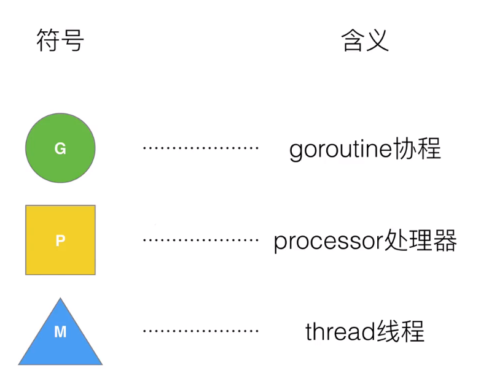
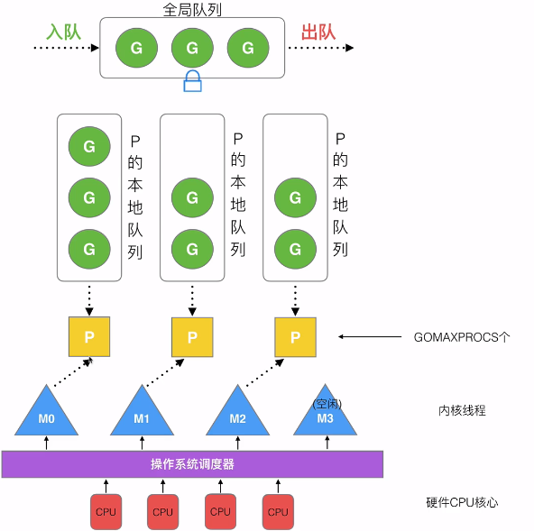
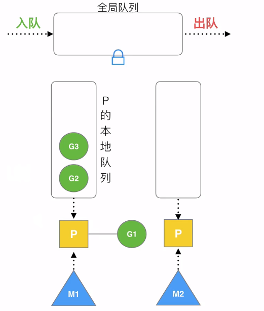
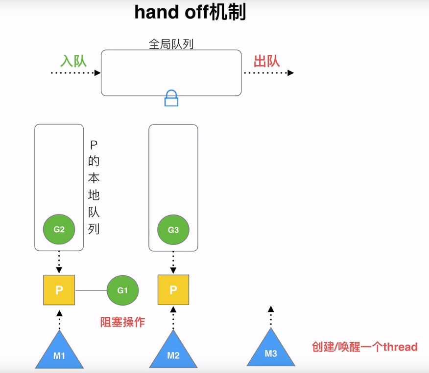
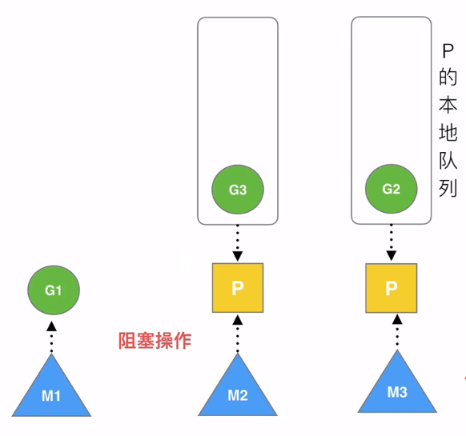

##goroutine设计思想

###GPM介绍

####术语介绍

G就是go语言协程

P包含了每一个G的资源，运行时需要找到协程的资源

M表示内核线程thread

####宏观GMP模型

P的本地队列是有数量限制的，一般不超过256个G，当队列满了后，会存放到全局队列中

P的数量是被GOMAXPROCS控制的。这个值可以在程序中配置。

M列表当前用于分配的操作系统程序的内核线程数

P和M的数量问题：

P的数量在程序中使用`runtime.GOMAXPROCS()`方法设置

M和P的数量无关，Go语言本身限定M的最大数量是10000个（忽略）。

M可以通过runtime/debug中的SetMaxThreads来设置，M的数量是动态的。每当一个M阻塞，或者睡眠，就会动态的创建和回收。

###设计策略

####worl stealing机制

当G1被P执行时，M2是空闲的，P会去之前的P中偷取G3执行

####hand off机制

当M1正在执行的G1阻塞了，会创建或唤醒一个thread M3 

G1继续阻塞到M1 M3接管M1的P，继续执行新的G

M1会睡眠或销毁

####抢占

每个G最多运行10ms，时间到了后新的G会抢占当前CPU。

####全局G队列

全局入队和出队会调用锁。

先从本地队列找，定期会从全局队列找，最后实在没办法，就去别的 P 偷。

https://qcrao91.gitbook.io/go/goroutine-tiao-du-qi/m-ru-he-zhao-gong-zuo

###go func()发生了什么

go func会创建一个G优先放入局部队列

###调度器生命周期

##Go调度器GMP全过程

