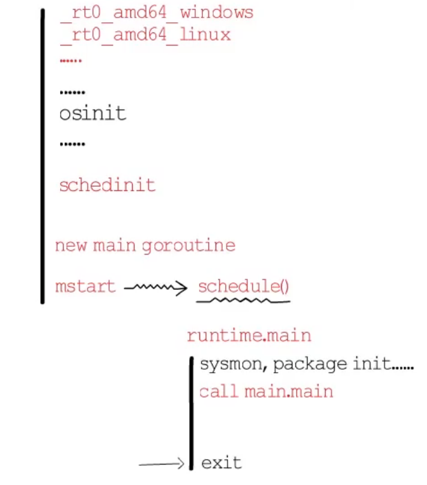
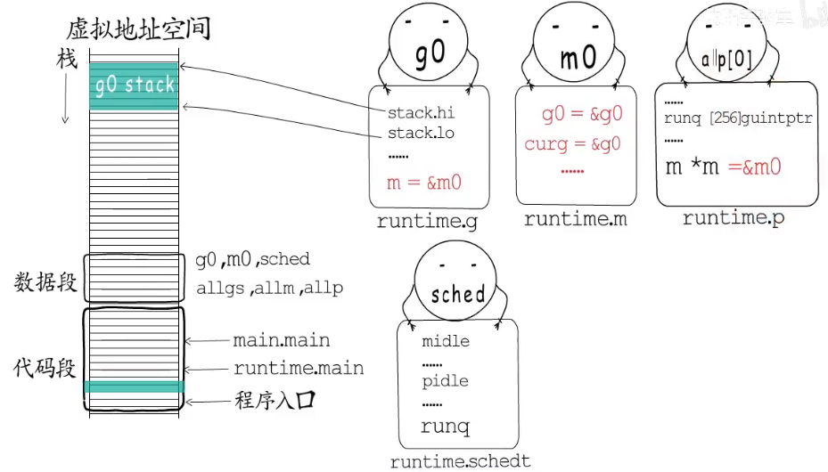
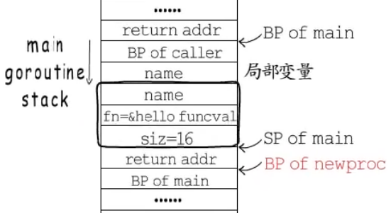
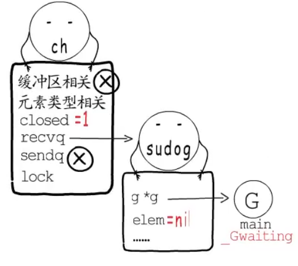
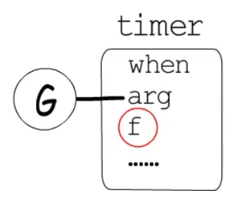
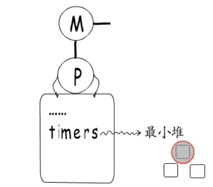
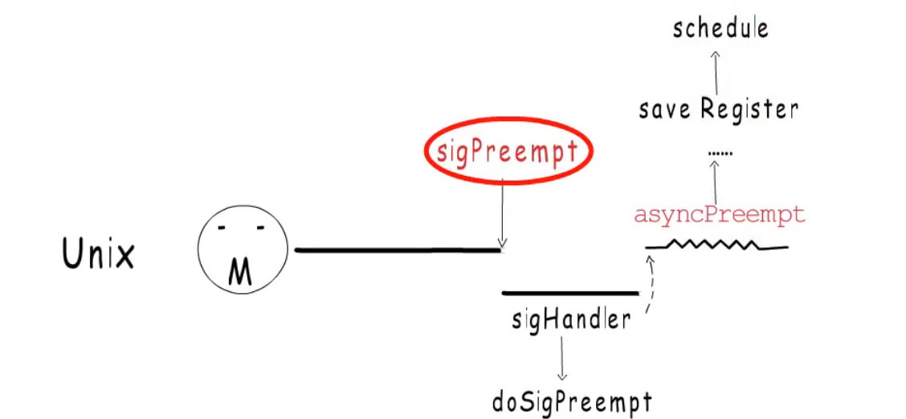

## 一个helloworld程序

```
package main
import "fmt"

func main(){
	fmt.Println("hello world!")
}
```

这个go语言的helloworld程序被编译成可执行文件后会如何执行？


首先不同平台下的入口程序不同如
`_rt0_amd64_windows` 和 `_rt0_amd64_linux` 但这不是我们要关心的。

在进行`osinit`后

调度器初始化 `schedinit` 这时会根据GOMAXPROCS创建多少个p保存到allp中并且把第一个p(allp[0])和m0关联

会以`runtime.main`为执行入口创建main goroutine

然后 main gorutine会开启调度循环 `mstart `----> `schedule()` 同时这个`mstart`也是所有的工作m的入口(不单单是m0的入口)

main gorutine执行起来后，会创建监控线程`sysmon`，进行`package init()`初始化。
随后再会调用我们的main.main `call main.main()`
在main.main返回后 `runtime.main`会调用exit()结束这个进程





### 不得不提的全局变量(data 段)





#### g0

初始化阶段的g0(对应的结构是runtime.g)是一个特殊的协程 他的协程栈是在主线程上面分配的。
g0持有m0的指针

#### m0

而m0对应的结构是runtime.m，也就是主线程对应的m。
m0也持有g0的指针 并且开始执行的协程为g0 `curg = &g0`

#### allgs ,allm

记录着所有的g和m

#### p

对于p来说它需要关联一个m 并且拥有一个本地的runq `runq [256]guintptr`
p关联到的m直接从runq中获取g

#### sched 调度器

这个结构中记录了所有空闲的m和p还有一个全局的runq
如果某个p的本地队列满了 需要新执行的g会加入到这个全局的runq中。

m执行g的顺序：
1. 先从自己的p的本地runq中执行g
2. 没有的话去调度器sched的全局队列runq中取得一些任务
3. 如果全局也没有会去别的p偷取一部分g


## 创建协程调用 hello world

```
func helloworld(){
	fmt.Println("hello world")
}

func main(){
	go helloworld()
}

```

### 这个程序有何问题？

进过上述讨论 main.main结束后会调用exit结束当前进程，所以 go helloworld()创建协程后程序还没来得及调度这个协程就结束了，所以没能打印hello world。

### 解决问题

在main结束之前必须要有足够的时间来调度这个协程

1. 使用time.sleep 
2. 等待chan
3. 或者for{}


```
func helloworld(){
	fmt.Println("hello world")
}

func main(){
	go helloworld()
	time.Sleep(time.Second)// sleep 1秒
}
```


## 带参协程创建，让出时间片与恢复运行

```
func helloworld(name string){
	fmt.Println("hello ",name)
}

func main(){
	name := "gorutine"
	go helloworld(name)
	time.Sleep(time.Second)// sleep 1秒
}
```


上述代码中在执行`go func()` 时会交给 `newproc`函数执行

`func newproc(siz int32, fn *funcval)`  参数1 协程入口函数参数占用字节数， 参数2 协程入口函数对应的函数指令地址。




newproc 做了两件事：1.切换到g0栈，2.调用newproc1函数

因为g0栈空间比较大，而函数不支持栈增长。协程栈比较小。所以要切换到g0栈避免栈溢出。

对于newproc1来说
`newproc1(协程入口地址，参数地址，参数大小，父协程，返回地址) ` 


### 通过等待一个channel让出协程
```
func helloworld(name string, ch struct{}){
	fmt.Println("hello ",name)
	close(ch)
}

func main(){
	name := "gorutine"
	ch := make(chan struct{})
	go helloworld(name,ch)
	<-ch
}
```

channel的数据结构是 `runtime.hchan`

记录了缓冲器相关，元素类型
是否关闭`closed` 度队列 `recvq`  写队列`sendq` 并发安全锁`lock`

当main执行到`<-ch`时main协程会阻塞到这个chan的`recvq`队列中这个队列是一个链表
这时chan通过`gopark`函数将这个协程挂起(_GWaiting)。并保存当前的协程执行现成，在调用当前m的g0栈
g0会调用schedule寻找下一个g。

当helloworld 协程完成工作关闭了这个chan 会将closed状态设置为1
并将recvq的协程的接受数据设置成nil,并调用goready函数结束等带的协程。并将这个协程设置为_GRunable状态。
通切换到g0栈，进行下一个协程调度。




## 协程让出，抢占，监控，调度


在timer中，到定时器时间结束后会调用其中的一个回调函数f 并且这个定时器上等待的协程设置为_GRunable状态。并将它们放回到runq中。



每个p都有一个最小堆存储了自己管理的timer，堆顶的timer就是下一个要调度的。




`sysmon`监控线程会重复执行一些任务并且会视情况调整自己的休眠时间
由于有些调度需要等待p被让出或抢占才能执行，这会导致timer不能及时执行。
`sysmon`会监控这些timer，一旦无法被直接执行时，会创建或唤醒一个新的线程来执行。

`sysmon`的职责：
1. netpoll网络轮询，监控会定时轮询网络事件监听列表。
2. 监控timer
3. 打断执行时间过长的g进行抢占操作。p里面有一个schedtick字段，每次调用新的g会将它+1，并且会记录调度时间，监控检测到的时间与now超出10ms并与这个次数不等，就很打断更新时间。也就是发生了新的调度。

go 1.14支持异步抢占。 Unix平台中会向这个相关m发出型号`sigPreempt`然后m会进入中断 执行中断句柄函数。并向这个协程中注入一个异步抢占协程调用函数。协程被恢复后会立即执行这个函数。




当g陷入系统调用(syscall)时m和g就会绑定，此时m会解除与当前p的关联，只是记录一下oldp。
p可能会被调度到其他m。当系统调用结束时，会把当前G放入全局runq中，当前m进入睡眠。

