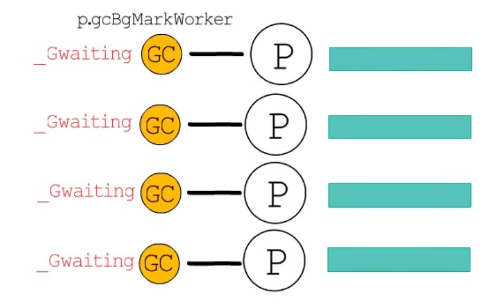
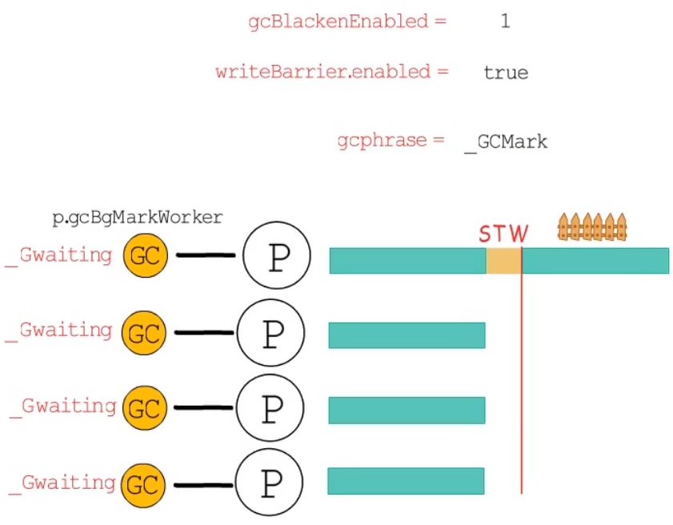
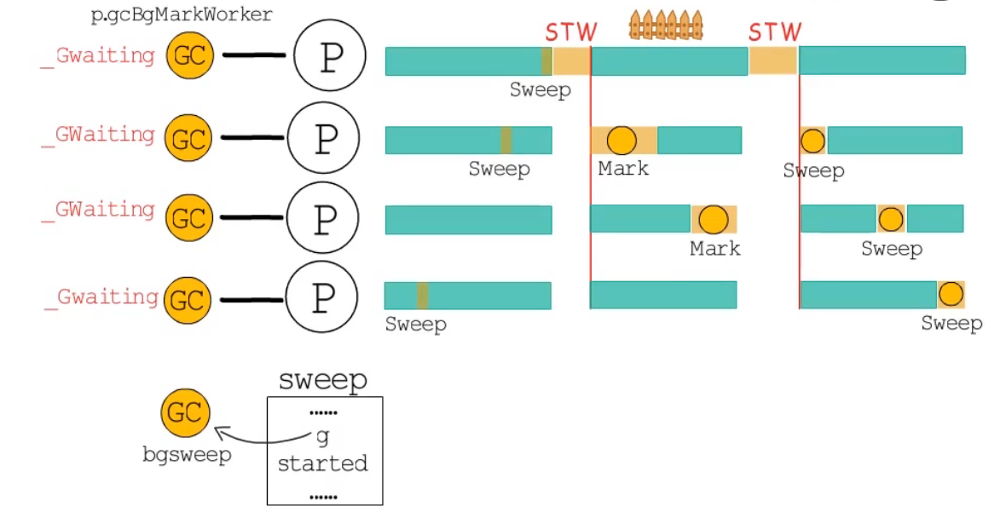
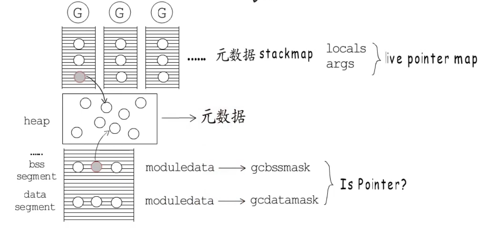
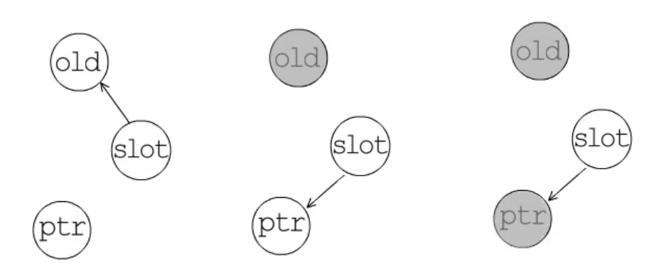

# golang gc过程简述

## golang gc

### 准备阶段




1. go语言的gc在准备阶段会为每个p创建一个markworker 协程 并将其指针存储到p中
2. 这些markworker创建完成后会很快进入休眠状态(_Gwaiting) 等待到标记阶段才能进行调度

这两步结束后会进入一个短暂的stw
这时会进行一些初始化

1. 开启写屏障 并将全局变量`writeBarrier.enabled = true`设置为true `gcphrase`变为`_GCMark` 
2. 全局变量`gcBlackenEnabled` 的值设置为1 表示允许进行GC标记工作
3. 等1,2步完成后结束STW这时候所以的P都会知道已经开启了写屏障





### 标记阶段

这时候所有的`markworker` 会进入活动状态（`_GRunning`）执行此时标记工作会和业务并行执行。

标记阶段结束后再次进行STW

### 标记结束

此时进行一次STW暂停，将 `gcphrase`设置为 `_GCMarkTermination` 表示标记已经结束
`gcBlackenEnabled` 设置成0.

然后进入GCoff阶段 关闭写屏障 `writeBarrier.enabled = false`  `gcphrase` 为 `GCOFF`

然后关闭STW 恢复程序

### 清扫阶段
`bgsweep`协程由`runtime.main`创建  其指针存储到全局变量`sweep`中 在清扫阶段这个协程会被加入到runq中。清扫工作也是增量进行的。所以在准备阶段之前要确保清扫工作已经结束。



## 标记工作

标记工作要从bss段 data段和协程栈这些root对象开始扫描追踪到堆上的对象。

go语言在编译时可以确定各个模块的全局变量信息，也就是`gcbssmask`和`gcdatamask`

运行中协程栈的元数据也会存储到 `stackmap`中 在局部变量 参数 返回值中确定哪些是存活的指针。并确定这些指针是否指向堆内存，如果指向堆内存会将其加入到gc标记中进一步扫描。




## gc cpu使用率

gc目标cpu使用率是25% 也就是 `GOMAXPROCS * 25%`
由于这个值可能不是整数就无法确定执行标记任务的markworker的个数
所以为了避免出现 6* 25% =1.5个worker这种情况
gc工作协程定义了两个工作模式: 
1. `Dedicated` 执行标记任务直到被抢占。
2. `Fractional` 除了被抢占外还可以达到目标时间时主动让出。这个模式的woker可能会被所有的p调用。

如果GOMAXPROCS 为4 只要启动一个 `Dedicated` 的worker
如果GOMAXPROCS 为6 除了要启动一个 `Dedicated` 的worker外还要启动一个`Fractional` 模式的worker

## gc过程中内存分配压力

go语言实现`gc assist`机制 **避免在标记和清扫中因过大的内存申请压力导致gc来不及回收的情况**
如果gc标记工作没有完成而业务协程要分配内存时，这个业务协程要负责一部分标记工作。
申请的内存越大，需要负责标记的任务就越多(债务偿还机制)。

每次协程申请内存和偿还债务都会记录下来，如果偿还的多那么可以抵消下次申请所欠的工作。
在清扫过程中也是，如果需要申请内存则要负责帮助清扫工作。

## 混合写屏障

伪代码：

```
writePoint(slot,ptr):
	shade(*slot)
	if current stack is grey:
		shade(ptr)
	*slot = ptr

```

在切断指针和某个对象联系时会出发删除写屏障 将被断开的那个对象置位灰色
在添加下游对象时会触发插入写屏障，将被指向的那个对象置为灰色



## gc 触发方式

1. 手动触发 `runtime.GC()`
2. 分配内存时需要检测是否需要触发gc, `runtime.mallocgc` 每次gc会在标记结束后设置下一次触发GC的堆内存分配量，`memstats.gc_trigger`。分配内存时会判断是否达到了这里的`gc_trigger`
3. `sysmon`监控线程强制执行GC，在runtime包被初始化时，会创建一个`runtime.forcegchelper()`为入口的协程。只不过这个协程会很快休眠，监控线程`sysmon`检测到距离上次gc已经超时会将这个协程加入到全局runq中。


