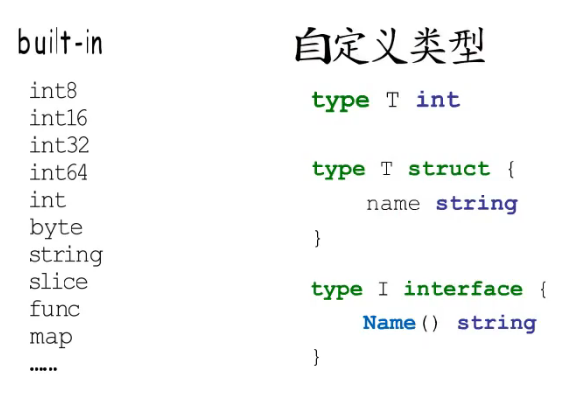
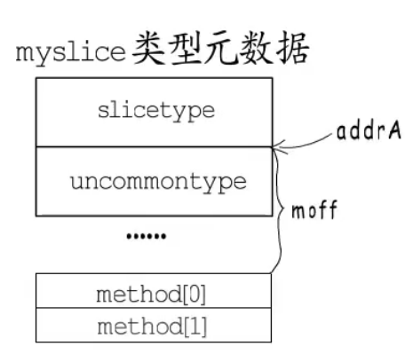
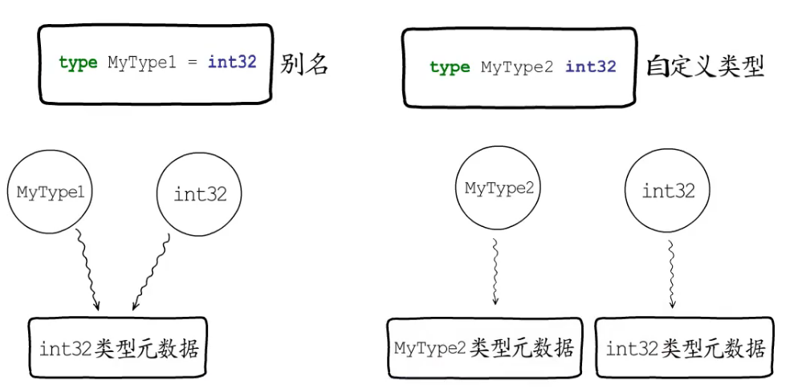
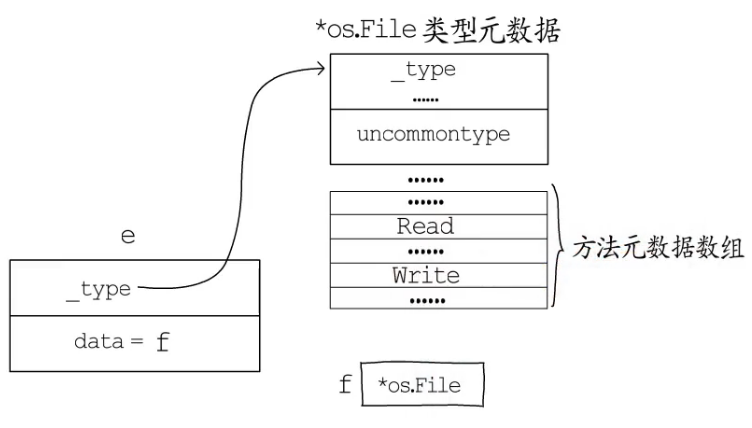
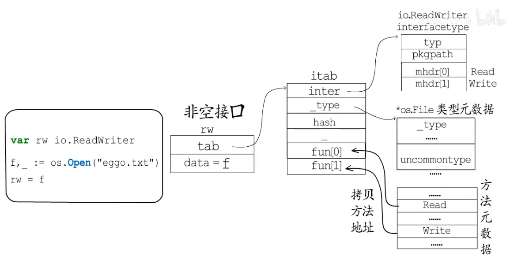
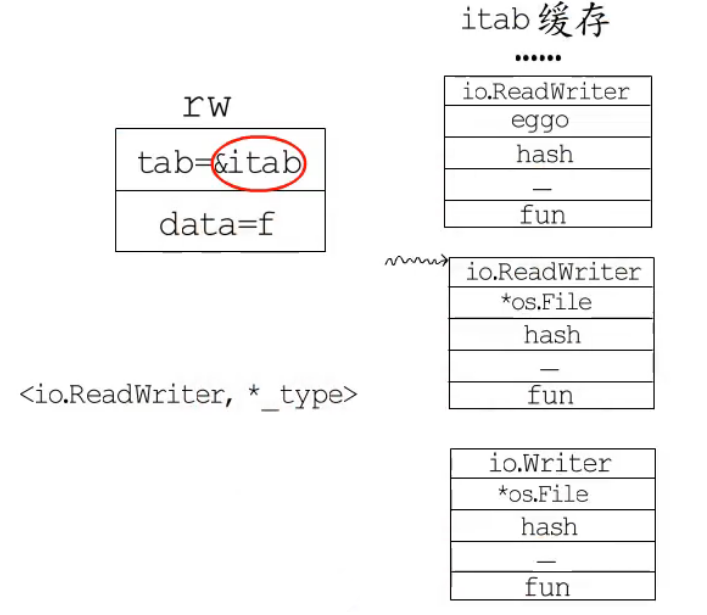
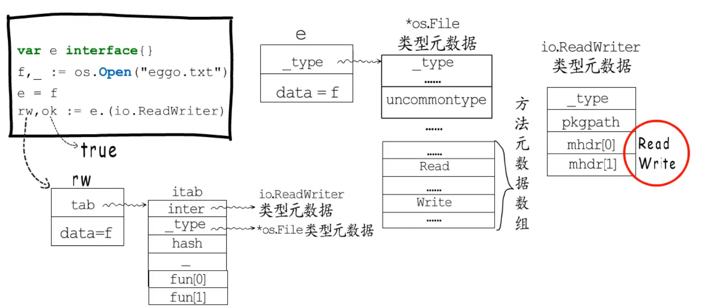
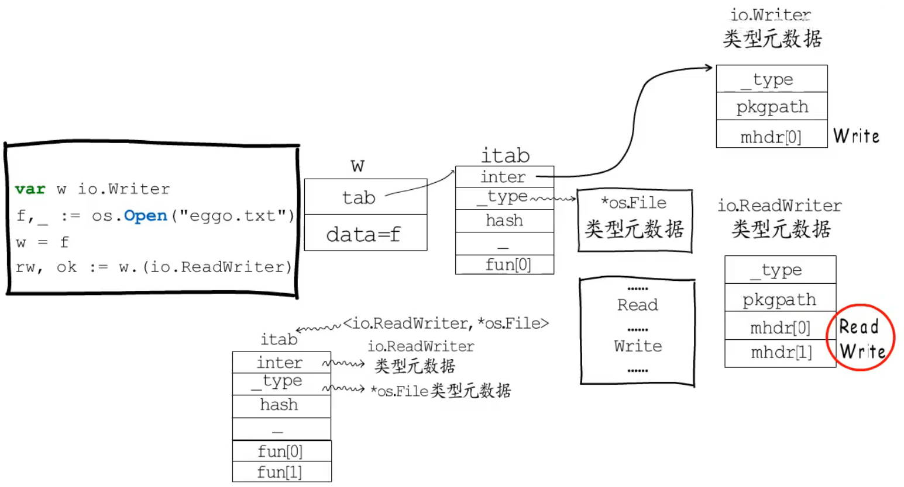

## 类型

定义一个结构体T关联方法F1

```
type T struct{
	name string
}

func (t T) F1(){
	fmt.Println(t.name)
}

func main(){
	t := T{name:"hello"}
	t.F1()
}
```

在t调用F1时实际上有个隐藏参数 T.F1(t) 也就是自己
在执行阶段 反射 接口断言是如何获取接口信息的




对于go语言类型，语言自建类型和接口是无法作为方法接受者的(也就是无法像T那样)


不管是自定义类型还是内置类型都有对应的类型描述信息----`类型元数据`

并且每种类型元数据是全局唯一的`runtime._type`
```
type _type struct{
	size       uintptr
	ptrdata    uintptr
	hash       uint32
	tflag      tflag
	align      uint8
	fieldalign uint8
	kind       uint8
	......
}
```
除了_type 各种类型还有存储其他信息

如 slice 中 elem指向类型元数据 如 []string 则elem指向 stringtype

```
type slicetype struct{
	typ  _type
	elem *_type
}
```

对于自定义类型还会有 uncommontype结构体

```
type uncommontype struct{
	pkgpath   nameOff
	mcount    uint16
	_         uint16
	moff      uint32
	_         uint32
}
```


其中 pkgpath   表示包路径 mcount表示该类型有多少个方法 moff 表示这些方法元数据组成的数组相对于 uncommontype偏移了多少字节

举例：
```
type myslice []string
func (ms myslice) Len(){
	fmt.Println(len(ms))
}
fumc (ms myslice) Cap {
	fmt.Println(cap(ms))
}
```

在这个类型中




根据moff就可以找到 Len和Cap的方法元数据（type method struct）了

`type MyType1 = int32` `type MyType2 int32` 的区别：




## 接口

### 空接口

空接口类型可以接受任意类型的数据，它只要知道数据在哪并且是什么类型的就足够了

`runtime.eface`

```
_type *type				//动态类型
data  unsafe.Pointer    //动态值
```

```
var e interface{}

f,_ := os.Open("test.txt")

e = f
```




### 非空接口

非空接口具有方法列表

```
type iface struct{
	tab *itab
	data unsafe.Pointer
}

```

一个变量要赋值给非空接口类型，必须实现这个接口的所有方法

```
type itab struct{
	inter *interfacetype
	_type *_type    //动态类型
	hash  uint32    //哈希值
	_     [4]btype
	fun   [1]uintptr  //动态类型方法地址
}

type interfacetype struct{
	typ      _type
	pakgpath name
	mhdr     []imethod  //接口要求的方法列表
}
```

举例：




## 断言

### 空接口.(具体类型)

```
var e interface{}
f,_ := os.Open("eggo.txt")
e = f
r,ok := e.(*os.File) //断言成功ok == true  r == f
```

这时候只要判断e的_type 是否指向 *os.File(类型元数据)即可


### 非空接口.(具体类型)

```
var rw io.ReadWriter

r,ok := rw.(os.File)
```

这时候只要判断 rw的 tab（动态类型是否为 *os.File）





### 空接口.(非空接口)

这里可以先去itab缓存中查找，并且还要判断fun[0] == 0




### 非空接口.(非空接口)





