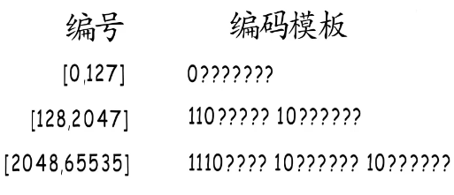
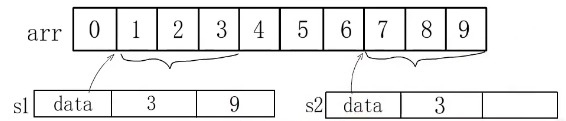
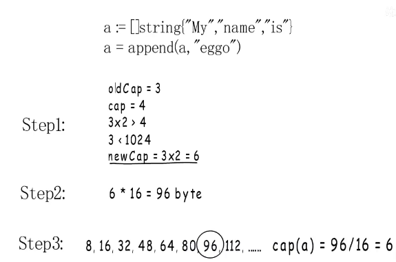

# 字符串和slice

## unicode

utf-8收录了大量字符
但对于中英文混合的字符串如何进行解码

`hello世界` 这个字符串 前面的字母占1个字节后面的汉字占2个字节

### 变长编码（utf-8 go语言默认）

以0开始的占一个字节 以110开始的占2个字节 以 1110的占3个字节

举例: 对于01100101这个字节
最高位为0表示这个字符占一个字节，出去第一个位 转换成十进制是101 对于e

举例: 对于11100100这个字节
以1110开头表示占3个字节，它要和后面两个以10开头的字节表示同一个字符如11100100 10111000 10010110
去掉标识位剩下的组合起来是 01001110 00010110 转换成十进制 --> 19990 也就是对应汉字"式"

编码举例： "界"字在unicode编号为30028
在[2048,65535]这个区间 所以要占用3字节
将30028转换成2进制 01110101 01001100 ---> 0111 010101 001100 在加上头部
最后编码后为 11100111 10010101 10001100

## string 类型是什么结构

在C语言中以'\0'为字符串结尾的标识符
在go语言中并没有这么使用

string类型有两个字段 一个是指向字符串的指针 data 一个是字符串长度 len
len并不是表示字符个数，而是表示字节个数 也就是说对于 "hello世界"这个字符串 len的值为5+6 = 11

go语言中可以使用下表如 str[2]读取字符串内容 ，但不能用下标修改它 str[2] = '0' 这样是不允许的
原因是字符串是只读的，字符串内容会被分配到只读内存段。

## slice

slice 结构有三个字段
1. data元素存储的地址
2. len 元素的个数
3. cap元素的容量

`var ints []int` 这个语句声明了一个slice   data为这个数组的底层地址，但至是声明了并没有赋值，所以data为nil，len为元素个数0，cap也为0

`var ints []int = make([]int,2,5)` 这个语句会开辟一段内存存储这个数组
data 指向这个数组的头部，len为2，cap为5
数组读写超出范围会发生panic

`arr := [10]int{0,1,2,3,4,5,6,7,8,9}`
`var s1 []int = arr[1:4]`
`var s2 []int = arr[7:]`

s1的容量从1开始到最后也就是9个并不等于整个数组的大小 ， s2也是从7开始到9一共3个

如果s2继续apped元素,原来的数组不能使用了，s2会继续开辟一个新数组容量是原来的2倍也就是6
然后把原来的元素拷贝到这个新的数组里面来。

## slice扩容规则：

如果 oldCap * 2 < cap 那么 新的newcap = cap
否则 oldLen < 1024 那么 直接翻倍
如果 oldLen >= 1024 扩容到原来的1.25倍 也就是扩大1/4

### 内存如何分配

由于go语言有自己内存管理，那么在分配时会选择一个足够大且接近的内存块
举例：如果要申请40字节内存，实际会直接分配48字节内存。如果元素为int
那么48 / 8 = 6 所以最终扩容后cap为6

