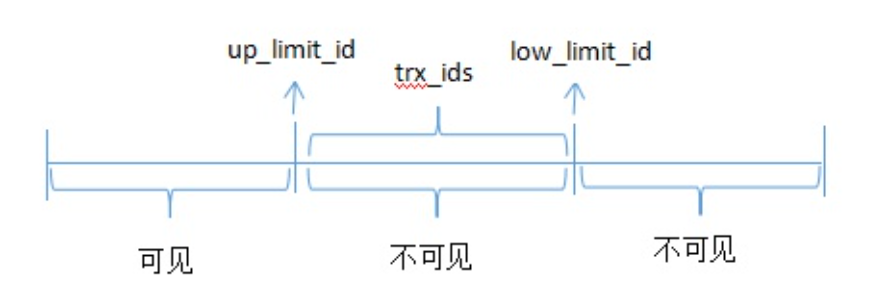

# mvcc简述

https://www.bilibili.com/video/BV1E44y1B77X

## undolog

`DB_TRX_ID` : 创建|修改该事务的id

`DB_ROW_ID`: 隐藏主键，如果表没有主键，也没有唯一键。自动生成一个。

`DB_ROLL_PTR`: 回滚指针。

name|age|gender|DB_RTX_ID|DB_ROW_ID|DB_ROLL_PTR|说明
--:|--:|--:|--:|--:|--:|--:
zhangsan|12|man|1|1|NULL|
lisi|12|man|2|1|0x124|指向上一条
lisi|11|man|3|1|0x125|指向上一条 ,最新值

链表的表头是最新的记录。

如果现在有一个事务4读取这个表，那么它应该读到哪行记录?如何判断和选择？

## readview

字段：

`trx_ids` ：系统活跃的事务ID,即Read View初始化时当前未提交的事务列表。

`up_limit_id`: 当前已经提交的事务号 + 1,也就是当这个readview创建时，这个事务id之前的(不包括自己)都是已经提交的事务了。

`low_limit_id`：当前最大的事务号 + 1，也就是当这个readview创建时，下一次事务即将要分配的事务id。换句话说，小于这个值的事务id是正在执行还未提交的和已经提交的。

### 情况1

事务1|事务2|事务3|事务4
--:|--:|--:|--:|
 | |||提交一个updatecommit
 | |快照读||

这个情况下这个快照度生成的readview是

trx_ids : 1,2,3 (活跃的事务，4已经提交所以不是活跃的)
up_limit_id : 1  (小于1的事务可见)
low_limit_id : 5 (下一个将要分配的事务是5)

undo log中最后修改的事务id DB_TRX_ID为4

规则：
1. DB_TRX_ID < up_limit_id 则当前事务可见
2. DB_TRX_ID >= low_limit_id 表示DB_TRX_ID是在这个readview生成后才出现的，那么对于当前事务肯定不可见
3. DB_TRX_ID是否在trx_id 中，如果在，表明readview生成时，这个事务还在活跃(没有提交)，所以不可见。如果不在表明这个readview是在commit之后看到的所以是不可见。

readview生成的时机：
RC: 在每次进行快照读的时候生成一个readview
RR:在第一次快照读的时候生成readview

由于mysql默认是rr级别

所以事务3生成readview时事务4已经提交，所以事务3的这个快照度可以看见这个提交。

### 情况2

事务1|事务2|事务3|事务4
--:|--:|--:|--:|
 |插入数据并提交|||
 | |快照读||
 | |||提交一个updatecommit
 | |快照读||

readview生成时

trx_ids: 2 3 4
up_limit_id : 2
low_limit_id : 5

DB_TRX_ID: 1 undolog中链表头

对于事务2的第一次快照读

由于 DB_TRX_ID == 1<  up_limit_id所以一定是可见的。

对于事务二的第二次快照读

DB_TRX_ID == 4 在trx_ids中 说明readview生成时这个事务还在活跃没有提交所以对于DB_TRX_ID ==4这个记录是不可见的。

## 原子性

使用undolog 进行事务回滚，执行失败时会根据rollbackptr回滚

## 隔离性

mvcc根据不同的隔离级别生成不同的readview对事务可见性进行判断。

## 持久性

> 对于磁盘来说，随机读写远慢与顺序读写。(append比较快)

mysql会将每次操作写入redolog

### 两次提交

> mysql修改数据一般会先读入内存
修改完后将操作写入redolog 此次写redolog并不能算已经持久化，这条记录会记录为prepare阶段
然后mysql会写binlog保证这两个log的一致性。随后将prepare阶段的redolog改commit状态.

### 快照读和当前读

当前读 操作
select  ... lock in share mode;
select ... for update;
update
delete
insert

快照读 操作

select ...
 
