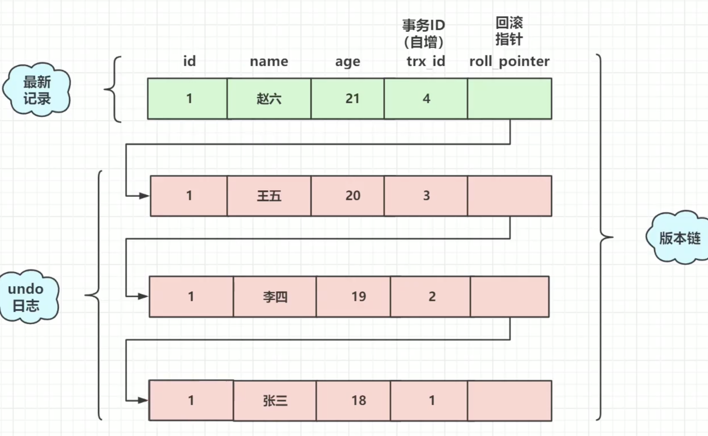

## innode和myisam的区别总结

https://blog.csdn.net/qq_35642036/article/details/82820178

1. myisam 不支持事务 innodb支持事务,innodb默认把每一条sql都封装成事务
2. innodb支持外键 myisam不支持 含有外键的转换会失败
3. myisam是非聚簇索引 innodb是聚簇索引
	1. 聚簇索引： 以主键作为key的B+树的叶子节点上存储数据，非主键的索引叶子节点上记录主键值。如果使用主键查找数据只需要一次查找便可以找到，如果使用非主键索引，必须先找到主键，在到主键索引树上找到数据。
	2. 非聚簇索引： 叶子节点不存储数据，而是存储指向硬盘地址指针。先查到索引后找到指针再拿到数据。并且主键索引和辅助索引是独立的。
4. innodb不保存表的行数。执行`select count(*) from table`时会全表扫描。而MyISAM用一个变量保存了整个表的行数，执行上述语句时只需要读出该变量即可，速度很快（注意不能加有任何WHERE条件）。
	1. 因为innodb拥有事务的特性，对于不同事务而言。表的行数不同。在计算count时，innodb会尽量遍历一个尽可能小的索引.
	2. 如果索引并没有完全处于InnoDB维护的缓冲区（Buffer Pool）中，count操作会比较费时。可以建立一个记录总行数的表并让你的程序在INSERT/DELETE时更新对应的数据。和上面提到的问题一样，如果此时存在多个事务的话这种方案也不太好用。如果得到大致的行数值已经足够满足需求可以尝试SHOW TABLE STATUS。
5. innodb支持表，行级锁 myisam只支持表级锁。

如何选择：
1. 需要支持事务一律innodb
2. 表中操作大多数为查询，可以选myisam 如果有读有写 选innodb
3. 不知道用什么就选innodb mysql5.5后默认使用innodb

## 事务的特性概述：
1. 原子性
	1. undo log (innodb) : 记录sql执行的相关信息，语句执行失败mysql会根据这个undo log进行相反的操作达到回滚的目的
	2. 一个事务要么全部提交成功，要么全部失败回滚，不能只执行其中的一部分操作.
2. 一致性
	1. redo log : 由于mysql存在buffer 读写都会先往buffer写入 所以每次操作都会计入redo log日志里面(实时同步落入磁盘，追加模式 速度很快)如果db宕机了可以通过redo log。
	2. 事务的执行不能破坏数据库数据的完整性和一致性，一个事务在执行之前和执行之后，数据库都必须处于一致性状态。
3. 隔离性
	1. 写-写 锁：不同的事物之间 不能相互影响 （行锁 表锁 间隙锁）每一次同一个数据只有一个事物操作。mysql锁的使用情况：`select * from information_schema.innodb_locks;`查询。
	2. 读-写 mvcc(脏读 不可重复读 幻读)
4. 持久性：事务再执行的前和后数据库的状态都是正常的.一个事务一旦提交，它对数据库中的数据的改变就应该是永久性的。接下来的其它操作或故障不应该对其执行结果有任何影响。

## 执行计划 Explain

字段|作用|
--:|--:|--:
id|当sql比较复杂时id会告诉我们哪条语句先执行哪条后执行

## MVCC（多版本并发控制）

快照读：读取的是历史版本的记录。 `select ...`
当前读：总是读取的最新的数据。`select ...... lock in share mode`  加共享锁  `select .... for update`. 加排他锁。update insert delete 。

### 隔离级别简述

1. Read Uncommitted（读取未提交内容）：允许脏读存在。可以直接读到其他事物未提交的内容。
2. Read Committed（读已提交内容）：一个事务只能看见已经提交事务所做的改变（不可重复读）。允许同一事务相同地读取两次内容却不同。
3. Repeatable Read（可重读）：MySQL的默认事务隔离级别，保证在事务处理过程中，多次读取同一个数据时，其值都和事务开始时刻是一致的，因此该事务级别禁止不可重复读取和脏读取，但是有可能出现幻读。其他事物在数据行中插入了新数据，导致两次读区相同的范围得到数据行数不一样。
4. Serializable（可串行化）：

### undo log

每个行都会包含用户不可见的字段。
DB_TRX_ID：表示创建修改该记录的事务ID，表示最近修改的事务ID
DB_ROW_ID：隐藏主键，如果没有主键和唯一键会使用这个字段代替
DB_ROLL_PTR：回滚指针，事务可能成功或失败，一旦失败可以通过这个指针找到上个记录。

历史书籍存储到undo log

roll_pointer 回滚指针

**read view** 作用 确定在哪个版本中取数据 （本质上是一个类型）执行一条语句（读已提交）会生成一个readview对象
每次事务（可重复读）也会生成一个
**在不同的事务隔离级别下readview生成的时机不一样**
mysql默认是可重复读级别RR

字段|作用
--:|--:|
m_ids|生成readview时当前系统中活跃的读写事务id列表(没有commit的事务id列表)
min_trx_id|生成readview时当前系统中活跃的事务中最小的事务id，也就是m_ids中的最小值
max_trx_id|生成readview时系统中应该分给下一个事务的id值
creator_trx_id|表示生成该readview的事务的id值

readview如何判断版本链中的哪个版本可用：
1. trx_id == creator_trx_id 可以反问这个版本 （自己创建的版本）
2. trx_id < min_trx_id 可以反问该版本（说明该trx_id是已经commit了的）
3. trx_id > max_trx_id:不可以访问该版本（max_trx_id是即将要分配给下一个事务的id，超出版本链）
4. min_trx_id <= trx_id <= max_trx_id:如果trx_id在m_ids中时可以访问该版本的，反之可以。(m_ids里面的都是活跃的事务不能访问)

幻读：假设我在同一个事务里面执行的了两次select 
第一次查询id>2的行得到3行，在这个select执行完后有别的事务提交了insert
第二次同样查询id>2的行得到了4行
如何避免：间隙锁 锁住id>2后面的所有行，别人就不能提交事务了.在rr这个隔离级别中默认开启间隙锁。

## 为什么选B+树索引

1. 哈希：1，存在哈希碰撞。2，哈希是无序的无法范围查找。
2. 二叉树，bst，红黑树：范围查找困难，io次数多。磁盘数据不连续。
3. B树：范围查找困难，io次数还是很多。data存储到非叶子节点
4. B+树：data存储到叶子节点。在硬盘中是连续的，范围查找只需要向后遍历。

mysql的B+树一般多少层：
3～4层的B+树支持千万行级别的数据存储
关于索引：一个int类型大小为4字节，如果索引小于4应该用varchar。一般key要尽可能少地占用空间。

前缀索引：根据统计结果确定使用多少个字节作为索引。

`alter table xxx add key(name(n))` n为字节数

`show index from xxx`  查看索引信息，里面的`Cardinality` 查看表中有多少条唯一值(索引值是可以重复的)。

## 索引优化

### 回表

表：id,name,age,gender			index:id(主键),name
`select * from table where name='zhangsan'`

分析：表中有两个B+树
执行步骤：先根据name找到对应的叶子节点拿到id值。
再到主键索引的B+树中通过这个id值找到对应的data

回表的效率比较低，尽量避免回表。

### 索引覆盖

`select id,name from table where name='zhangsan'`

根据name去B+树中找到id的值，此时由于只要id和name，因此不需要回表查询data。（索引的叶子节点中包含了所有的查找列）。效率较高

### 最左匹配

联合索引在查找时需要遵循最左匹配。 

index(name,age)

`select * from table where name='zhangsan' and age=12`

`select * from table where name='zhangsan'`

`select * from table where age=12`

`select * from table where age=12 and name='zhangsan'`

4条查询中只有1和2是能走索引查找的。第4条mysql会用优化器将索引调整成1的情况

### 索引下推

index(name,age)

`select * from table where name='zhangsan' and age=12`

没有下推的话：mysql会先通过name将数据拉到server层，再根据name和age筛选结果。
有索引下推：mysql会直接在引擎里面通过name和age进行筛选。

### 如何优化

## mysql的锁

https://zhuanlan.zhihu.com/p/29150809

### 宏观
#### 数据库的锁

* 粒度小方便集群

#### 代码锁

* 粒度大 需要封装

### 微观

#### 行锁
只有明确指定 主键才会执行行锁，否则位表锁

`select * from table where id = 1 for update;`(for update 排他锁)

#### 表锁

主键不明确

`select * from table where name = "123" for update;`

锁住整张表 

#### 无锁

`selet * from tabe where id = -1 for update;`

由于id是从i开始所以不会枷锁

