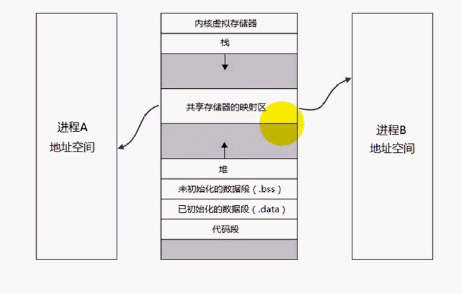
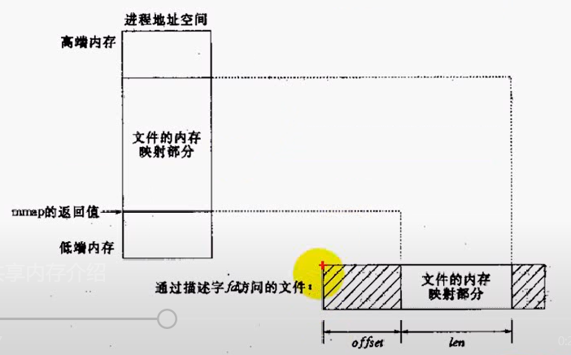

#Linux系统编程 day04
[**本章源代码下载**](code/day04.rar)
##共享内存
共享内存是最快的IPC
一旦内存映射到了共享进程的地址空间，这些数据就不在设计内核调用
直接用内存操作函数就能进行读写操作



##函数mmap

**函数原型：**`void *mmap(void *addr, size_t length, int prot, int flags, int fd, off_t offset);`

**功能：**将文件或者io映射到共享内存区
成功返回内存的实际地址失败返回-1



**参数：**

* addr：地址空间NULL表示让内核自动选择，如果填入地址但是我们制定的地址空间可能不是页面的整数倍
此时会自动对齐到给定页面的整数倍(页面指：内存页面)
* length：长度
* prot：
   * PORT_READ        可读
   * PORT_WRITE      可写
   * PROC_EXEC        可执行
   * PORT_NONE       不可访问
* flags：
   * MAP_SHARED变动是共享的，变动会写回到文件
   * MAP_PRIVATE变动是私有的(写入操作不好影响到其他进程)变动不会写入
   * MAP_FIXED准确解释addr
   * MAP_ANONYMOUS建立匿名区，不涉及文件，吧后面两个文件忽略，并不是文件的映射，这时就只能给有亲缘关系的进程访问
* fd：文件描述符
* offset：偏移量

mmap函数会创建的共享内存是以页面为单位的。如果lenth小于单个内存，则会创建一个内存页面
mmap会自动对齐页面，共享内存大小是页面的整数倍

od -c [文件名] 查看文件内容

**注意：**

* 映射不能改变文件的大小
* 用于进程间的共享内存空间不受限于被映射文件的大小
* 当文件被映射后，对映射区域的访问是对内存的访问
* 用社区域内容写回文件时，所写不能超过文件大小否则会丢失数据

##函数msync

**函数原型：**`int msync(void *addr, size_t length, int flags);`

**功能：**对共享内存进行写操作，可能没有立刻写回文件中
如果想要立刻写回文件，需要调用此函数同步到文件中
MS_ASYNC		异步写
MS_SYNC			同步写
MS_INVALIDATE	使高速缓存中的数据失效


##system V共享内存
共享内存数据结构：
```
struct shmid_ds {
    struct ipc_perm shm_perm;    /* Ownership and permissions */
    size_t          shm_segsz;   /* Size of segment (bytes) */
    time_t          shm_atime;   /* 最后一次映射的时间*/
    time_t          shm_dtime;   /* 最后一次解除映射的时间*/
    time_t          shm_ctime;   /* 创建时间*/
    pid_t           shm_cpid;    /* 创建进程号*/
    pid_t           shm_lpid;    /* 最后一次脱离的进程号*/
    shmatt_t        shm_nattch;  /* 当前共享内存被链接的次数*/
};
```
##函数shmget
**函数原型：**`int shmget(key_t key, size_t size, int shmflg);`
**功能：**创建/打开一个共享内存成功返回共享内存的标识码，失败返回-1
**参数：**

* key:键值
* size：共享内存大小
* shmflg：九个权限标志，用法与创建文件mode相同

##函数shmat
**函数原型：**`void *shmat(int shmid, const void *shmaddr, int shmflg);`
**功能：**将功能性内存链接到进程的地址空间，成功返回链接到的指针
**参数：**

* shmid：id号
* shmaddr：指定地址	NULL表示自动选择
		如果不为NULL 并且没有SHM_RND标记 则以该参数为链接地址
		如果设置了SHM_RND标记，连接的地址会自动下调整为SHMLBA的整数倍
		公式为：shmaddr-(shmaddr%SHMLBA)
* shmflg：SHM_RND 
				SHM_RDONLY表示用来只读

##函数shmdt
**原型：**int shmdt(const void *shmaddr);
传入与共享内存联系的指针，将共享内存段与当前进程脱离
类似于free

##函数shmctl

**函数原型：**`int shmctl(int shmid, int cmd, struct shmid_ds *buf);`
**功能：**由于共享内存是随内核持续的所有的进程退出后都还存在
使用该函数可以控制删除它

**参数：**

* shmid：标识码
* cmd：命令控制动作
		IPC_STAT	获取状态
		IPC_SET		设置状态
	IPC_RMID	删除共享内存
* buf：保存共享内存模式状态等的数据结构	


