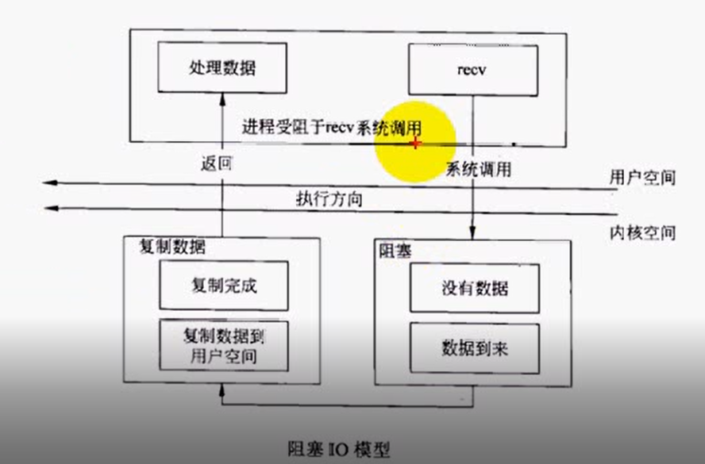
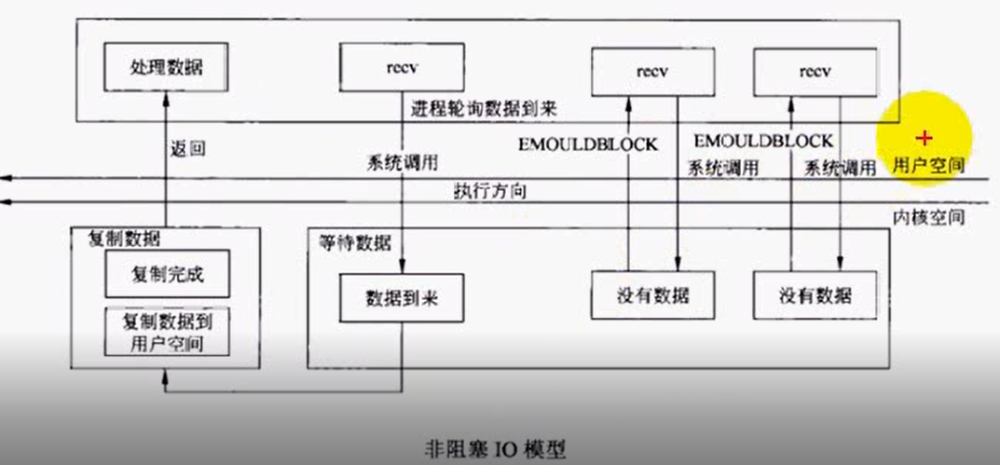
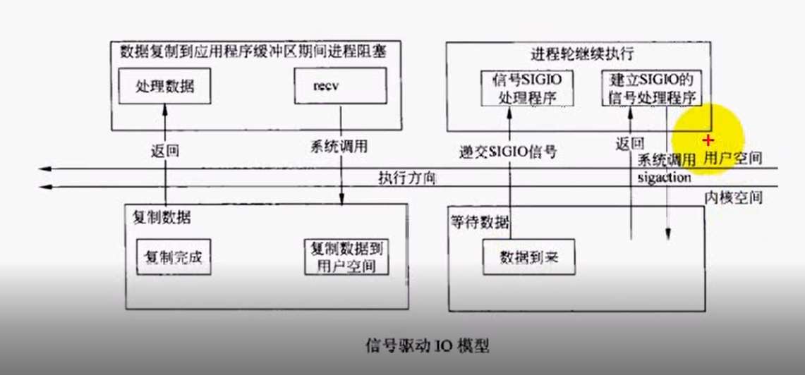
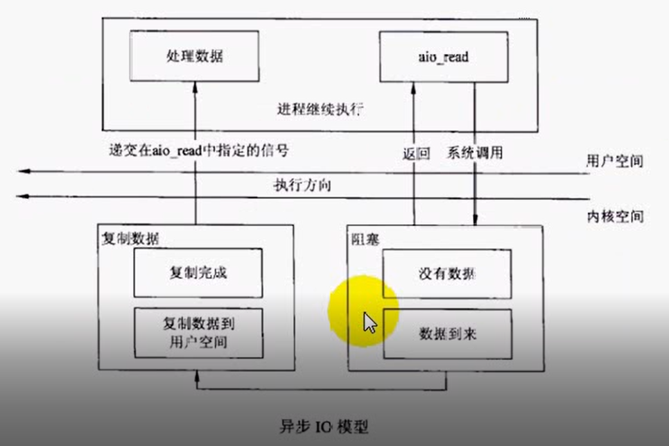

#Linux网络编程
##day04
* [本章源代码下载](../code/day04.rar)

今天进一步TCP完善回射服务器

**僵尸进程问题**

* 在链接断开后通过命令：
	`ps -ef| grep server`
可以查看子进程为僵尸进程 

**解决方法：**

* 处理`SIGCHLD`信号来处理子进程将其退出
注册信号`signal(SIGCLD, handler_sigchld)`
```
void handle_sigchld(int sig) {
	while (waitpid(-1, NULL, WNOHANG) > 0);
}
```
多次调用waitpid  处理成功会返回大于0，当没有进程时(由于WNOHANG(该进程不会挂起))会返回-1,处理结束

关于`waitpid`功能以及参数介绍

函数原型: `pid_t waitpid(pid_t pid, int *status, int options)`

**功能:**

* 成功返回进程号否则返回-1
使用选项WNOHANG没有子进程退出返回0

**参数：**

* pid>0:只等待该pid进程结束
pid=-1:等待任意子进程退出
pid=0:等待其组ID等于调用进程组的任一子进程
pid<-1:等待其组ID等于pid绝对值的任一子进程

* status:该子进程退出时的结束状态 一般填NULL
* options:
   * WNOHANG:由pid指定的子进程没有结束则该函数不阻塞立即返回
   * WUNTRACED:为了实现某种操作由pid指定的任一进程已被暂停，且其状态自暂停以来未报到过此时返回值为0
   * 0:阻塞父进程等待子进程退出

##day05
[本章代码下载](../code/day05.rar)

**了解TCP的11种状态以及5种IO模型**

')

虽说有11种但图中只有10种
客户端主动链接服务器(3次握手)
客户端主动发起close(4次挥手)服务器全程处于开启状态
客户端关闭后会保持一段`TIME_WAIT`状态
* TIME_WAIT：保留两倍的MSL时间。大概一分钟左右。
close发起段在发送最后一个ACK后进入两倍的MSL等待状态，主要是要确定对方收到ACK
如果没有收到的话就会重新发送FIN包再次断开。在这个时间段端口是不能被占用的。


第11种状态``CLOSING``


客户端和服务器同时发起close，两者都会进入到closing状态
并且关闭后都会存在`TIME_WAIT`状态

观察状态指令`netstat -an`
某一端口指令：`netstat -an | grep tcp | grep 端口号`

**关于SIGPIPE信号**

当TCP链接的某一段接收到FIN时就代表对方不会再发送数据了
但仍然可以调用write函数向对方发送数据
此时TCP协议栈会发送RST段，如果再次调用write函数就会得到SIGPIPE信号(默认处理方式是结束进程)
我们只要忽略这个信号就行了

####5种IO模型
**阻塞I/O**



* 接收recv调用时系统处于阻塞状态，当数据到来时，将数据接从收缓冲区复制到用户缓冲空间，然后解除阻塞
函数返回

**非阻塞I/O**


* 调用`fcntl`函数将套接口设置为非阻塞模式	`fcntl(fd,F_SETFL,flag|O_NCNBLOCK)`
这时候即使没有数据到来也不会阻塞，但会返回一个错误`EWOULDBLOCK`返回值为-1

**I/O复用(select poll)   重点！！** 



* 利用`select`来管理多个文件描述符，将阻塞位置提前到`select`

**信号驱动I/O**



* 这个模型不是很常用
建立`SIGIO`信号处理程序
程序处理其他任务，当有数据到来时以信号的方式来通知，跳转到系统中在调用`recv`

**异步I/O**



* 效率最高
利用`aio_read`函数实现
这个函数提交一个请求并创建一个缓冲区`buf`
即使没有数据到来，也立刻返回。当有数据到来之后内核会自动将这些数据拷贝到`buf`中
通过一个信号`SIGIO`来通知应用程序
内核------>缓冲区
由于其实现存在问题，很少得到推广

##day06

[本章源代码下载](../code/day06.rar)

**今天重点学习IO复用，函数`select`的用法**

**select函数的功能以及参数讲解：**

函数原型：

`int select(int nfds, fd_set *readfds, fd_set *writefds,fd_set *exceptfds, struct timeval *timeout);`

**功能：**

* 这个函数可以管理多个IO
一旦其中有一个或多个IO检测到我们感兴趣的事件
select就立刻返回
并且将这些事件填充到我们感兴趣的集合中
并返回这些事件的个数
此时就不会阻塞，应为select提前阻塞了
select是一个管理IO的管理者
* 在之前的回射服务器中
当服务器close时会发送FIN的TCP段
但是对于客户端来说，程序阻塞在标准输入位置
不能接收到TCP段就不能退出循环调用close
* 本质:
	从输入接收数据和readline获取TCP数据不能同时处理
解决方法:使用select管理这两个IO

返回准备到的事件个数

**参数：**

* nfds : 读,写,异常的描述符的最大值+1
	假设现在有描述符 1 3 7 9
那么这个参数就是 9 + 1 = 10
* readfds : 读的集合 检测到数据可读的IO就放在这个集合中
* writefds : 可写的集合
* exceptfds : 异常集合
* timeout : 超时时间 NULL表示不会超时一定要检测后返回
如果指定超时时间，在超时后返回，并且事件个数为0
失败返回-1

**关于描述符与集合的函数：**            
`void FD_CLR(int fd, fd_set *set);`
将文件描述符fd从集合set中移除

`int  FD_ISSET(int fd, fd_set *set);`
判断fd是否在集合中

`void FD_SET(int fd, fd_set *set);`
将fd添加到集合中

`void FD_ZERO(fd_set *set);`
清空集合

**任务：**

利用select改进回射客户端程序

* 改进前由于不能检测到FIN段所以是CLOSE_WAIT状态
改进后可以看见客户端变成TIME_WAIT状态
```
char sendbuf[1024] = { 0 };
	char recvbuf[1024] = { 0 };
	fd_set rset;
	FD_ZERO(&rset);
	int nready;
	int maxfd;
	int fd_stdin = fileno(stdin);  //fileno用来取得参数stream指定的文件流所使用的文件描述符
	if (fd_stdin > sock) {
		maxfd = fd_stdin;
	}
	else
		maxfd = sock;
	while (true) {
		/*将fd_stdin 和 sock加入到读集合中*/
		FD_SET(fd_stdin,&rset);
		FD_SET(sock, &rset);
		/*不关心 写 异常 超时*/
		nready = select(maxfd + 1, &rset, NULL, NULL, NULL);

		if (nready == -1)
		{
			perror("select");
			exit(EXIT_FAILURE);
		}
		if (nready == 0)
			continue;
		if (FD_ISSET(sock, &rset)) {//检测到可读事件sock
			ssize_t ret = readline(sock, recvbuf, sizeof(recvbuf));

			if (ret == -1) {
				perror("readn()");
				break;
			}
			if (ret == 0) {
				printf("pid = %d 离开了服务器 0 \n", getpid());
				break;
			}

			fputs(recvbuf, stdout);
			memset(sendbuf, 0, sizeof(sendbuf));
			memset(recvbuf, 0, sizeof(recvbuf));
		}

		if (FD_ISSET(fd_stdin, &rset)) {//检测到stdin可读

			if (fgets(sendbuf, sizeof(sendbuf), stdin) == NULL)
				break;

			writen(sock, sendbuf, strlen(sendbuf));
		}
	}
```
