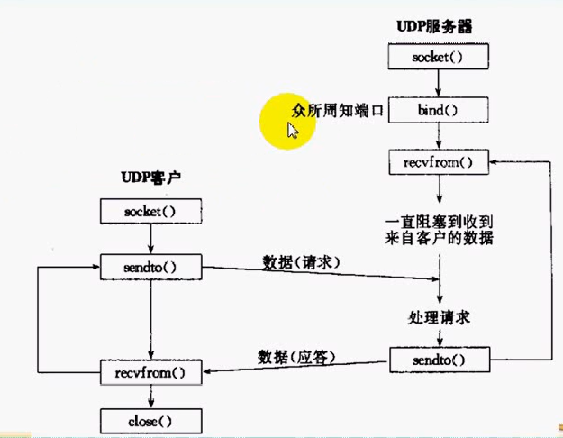

#Linux网络编程
##day10
[**源代码下载**](../code/day10.rar)

今天主要介绍函数`poll`和了解`select`函数的不足之处

**`select`的限制：**

* 一个进程最大能打开的文件描述符的限制
	命令 ： ulimit -n
	调整命令 ：sudo ulimit -n [数字]
	
相关函数：`int getrlimit(int resource, struct rlimit *rlim);`
	获取资源限制信息保存在结构体rlim中
```
struct rlimit {
               rlim_t rlim_cur;  /* Soft limit */
               rlim_t rlim_max;  /* Hard limit (ceiling for rlim_cur) */
};	
```
函数 `int  setrlimit(int  resource,  const struct rlimit *rlim);`
修改
```
rl.rlim_cur = 2048;
rl.rlim_max = 2048;
```
注意该程序应该运行在root权限下
并且只能更改当前进程和其下的子进程，并不影响到父进程

* fd_set 集合容量最大值为`FD_SETSIZE `这个宏的大小是1024


**函数`poll`**
函数原型：`int poll(struct pollfd *fds, nfds_t nfds, int timeout);`
功能：与`select`一样实现套接字的管理

参数：
```
struct pollfd {
               int   fd;         /* 套接字 */
               short events;     /* 感兴趣的事件 */
               short revents;    /* 如果事件发生了就返回到这个变量中 */
           };
```
* `events`与`revents`可取的值以及含义
   1. POLLIN 有数据到来文件描述符可读
   2. POLLPRI 紧急数据带外数据
   3. POLLOUT 可写事件
   4. POLLERR 错误发生
   5. POLLRDHUP 流式套接字半关闭
   6. POLLHUP 关闭

* nfds :套接口数量
* timeout：超时时间

任务：改写回射服务器程序


##day11
[**源码下载**](../code/day11.rar)

####对比`select`与`poll`

1. `select` 一个进程能打开的最大文件描述符限制  `FD_SETSIZE`的限制
2. `poll`只有进程限制，并且这个限制很容易更改

共同点：在内核中都要遍历所以感兴趣的文件描述符直到找到发生事件的文件描述符
对于这点epoll的会比这两个函数有更高的效率


**epoll的使用**

```
int epoll_create(int size); //该函数在内核中使用哈希表实现，所以要指定容量
　　　　　　　　　　　　//成功时返回epoll文件描述符，失败时返回-1
int epoll_create1(int flags);//使用红黑树实现，所以不需要指定容量了
int epoll_ctl(int epfd, int op, int fd, struct epoll_event *event);
　　　　　　　　　　　　//成功时返回0，失败时返回-1
int epoll_wait(int epfd, struct epoll_event * events, int maxevents, int timeout);
　　　　　　　　　　　　//成功时返回发生事件的文件描述数，失败时返回-1
```

关于epoll效率高有一下几点：

1. 不会伴随监听fd增长降低效率 select和poll是依靠轮询来处理
2. select和poll检测到事件后需要通知给上层的应用程序
通过内存拷贝的方式将消息通知给应用程序
而epoll是通过共享内存的方式，不需要进行内存拷贝
3. epoll基于回调如果fd有期望事件发生，就通过回调的方式加入epoll就绪队列中，也就是说只关心活跃的fd
4. 应用程序可以直接得到事件，不需要遍历fd
当我们将fd加入到epoll进行管理的时候还指定了一个事件，当产生事件时就能找到相应的fd不需要遍历fd，只需要判断是什么事件就可以了

`EPOLLLT`模式(电平触发)
靠内核驱动，当epoll_wait返回fds时，这些fds我们认为它们处于就绪状态

`EPOLLET`模式(边沿触发)
系统只是通知应用程序fds变成了就绪状态，此后epoll不在关心这个fd的任何信息(从epoll队列中移除)
直到应用程序用过读写操作触发EAGAIN状态，那么epoll就会认为这个fd处于空闲状态，从而重新加入epoll队列中

**结论：**
伴随着epoll_wait的返回，队列fds是逐渐减少的，在大型并发系统中更具有优势，但维护难度更高

任务：使用epoll改写回射服务器

**关键代码:**

1. 本次代码使用到了c++ 里面的vector容器 `typedef vector<struct epoll_event> EventList;//定义EventList类型方便使用`
```
vector<int> clients; 
int epollfd;
	epollfd = epoll_create1(EPOLL_CLOEXEC);//创建epoll实例句柄
```

2. 添加监听套接字listenfd到`epoll`中
```
struct epoll_event event;
	event.data.fd = listenfd;
	event.events = EPOLLIN | EPOLLET;
	epoll_ctl(epollfd, EPOLL_CTL_ADD, listenfd, &event);
```
3. 在大循环(`while(true)`)中,这里相当于`select`
```
nready = epoll_wait(epollfd, &*events.begin(), static_cast<int>(events.size()), -1);
		//这里用&*events.begin()是应为begin()的返回值是一个迭代器所以不能直接使用
//。。。。。
if (events.size() == (size_t)nready) {//如果nready与size()大小相等就将容器的大小扩大2倍
			events.resize(events.size() * 2);
		}
```
4. 对于`listenfd`套接字如果连接之后将连接到的`conn`加入到epoll中
```
if (events[i].data.fd == listenfd) {
				socklen_t peerlen = sizeof(peeraddr);
				conn = accept(listenfd, (struct sockaddr*)&peeraddr, &peerlen);
				if (conn == -1) {
					perror("accept");
					exit(EXIT_FAILURE);
				}
				printf("ip: %s port:%d \n", inet_ntoa(peeraddr.sin_addr), ntohs(peeraddr.sin_port));
				clients.push_back(conn);
				activate_nonblock(conn);
				event.data.fd = conn;
				event.events = EPOLLIN | EPOLLET;
				epoll_ctl(epollfd, EPOLL_CTL_ADD, conn, &event);
			}
```
5. 如果是连接套接字有事件发生完成接收进行回射
```
else if (events.at(i).events & EPOLLIN) {//如果不是listen套接字有内容输入就处理这个套接字
				conn = events.at(i).data.fd;//将这个套接字赋值给conn
				if (conn < 0)
					continue;
				char recvbuf[1024] = { 0 };
				int ret = readline(conn, recvbuf, 1024);
				if (ret == -1) {
					perror("readline");
					exit(EXIT_FAILURE);
				}
				if (ret == 0) {
					printf("client close\n");
					close(conn);
					event = events[i];//
					epoll_ctl(epollfd, EPOLL_CTL_DEL, conn, &event);//将这个fd删除
					clients.erase(remove(clients.begin(), clients.end(), conn), clients.end());//将这个套接字从列表中删除
				}
				fputs(recvbuf, stdout);
				writen(conn, recvbuf, strlen(recvbuf));
			}
```


##day12
[**本章源码下载**](../code/day12.rar)
####UDP协议的特点
1. 无连接 TCP需要进行三次握手连接而UDP不需要
2. UDP是基于消息的传输服务，而TCP是基于流的，对于UDP而言不需要处理粘包问题
3. UDP是不可靠的，数据包可能丢失，重复，乱序，缺乏流量控制
4. UDP对比TCP更加高效

**UDP基本模型：**
服务器端：创建一个套接字绑定地址，直接接收数据
客户端：创建套接字后往对方的地址发送数据即可



任务：实现UDP回射服务器

####UDP产生的问题：

* UDP的报文可能会丢失，重复，如果要实现一个可靠的传输，我们要处理丢失和重复的问题，发送端要起动一个定时器，超时后要重新传输，接收方也要处理超时问题
* UDP报文可能乱序，我们要维护报文的序号
* UDP缺乏流量控制，当缓冲区满的时候，我们如果再往里面发送数据，机会将数据覆盖到原来的缓冲区
我们可以模拟TCP滑动窗口协议来达到流量控制的目的
* UDP协议数据报文可能会截断，如果数据报大于缓冲区，就会截断，那些数据已经被丢弃了
* recvfrom 可以返回0  发送的数据是0字节的话，收到大小为0不代表连接关闭，因为UDP是无连接的
* ICMP异步错误：如果客户端启动程序而服务器没有启动，当客户端发送一行数据时，会得到一个ICMP错误应答在接收时会产生，recvfrom会一直阻塞，这个错误不会通知给未连接的套接字
* UDP connect：调用connect函数但UDP不会建立一个连接，仅仅只是维护了一个信息，此时就能解决上述错误，异步的ICMP错误就能返回给套接字，通过这个套接字能发送给对等方，这个套接字相当于给远程地址一个绑定，那么这个套接字就不能发送给其他地址了
一旦连接成功之后，在sendto时不需指定对方地址，因为connect已经指定了，这时也可以使用send和recv来发送接收数据
* UDP外出接口确定规则：假定客户端的IP地址有多个处于不同网段调用sendto向客户端的某个IP发送数据，服务器端就默认选择这个IP网段的地址作为外出接口，connect同理，如果与客户端某个IP绑定，那么外出接口就会默认选择这个网段的IP作为外出接口
*外出接口就是发送数据的IP地址*

