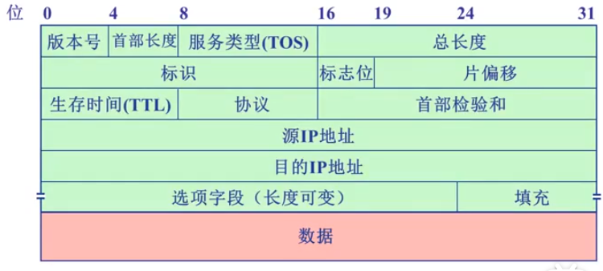
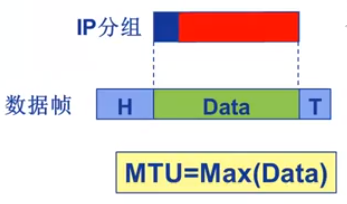
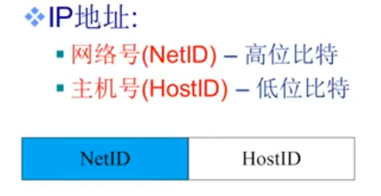
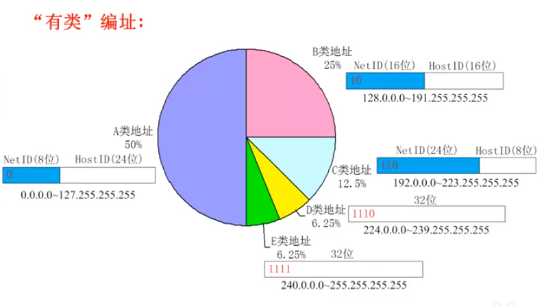
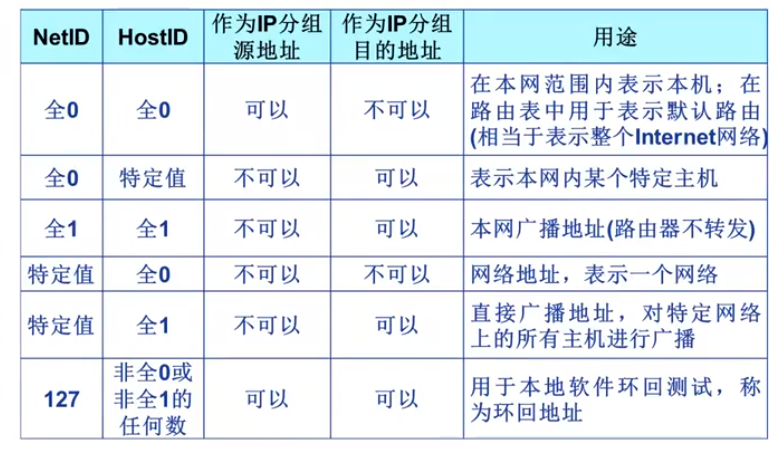
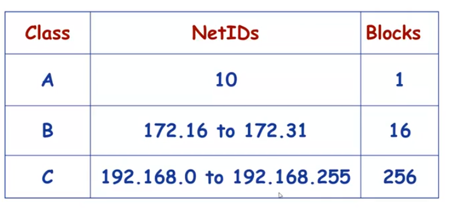
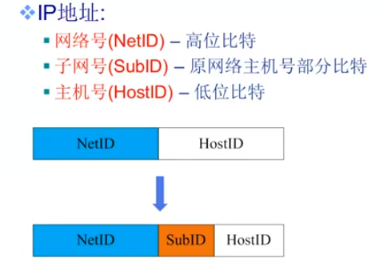

## IP头部组成

选项字段前为固定部分。

1. 版本号4bit位，IP协议的版本  4-IPV4  6-IPV6
2. 首部长度4bit位 最大为16，IP分组的首部长度 每个数字代表IP头部有多少个32bit   举例：如果首部长度为5  意思是整个头部长度(固定部分+选项字段 + 填充)为 5 * 32 bit
3. TOS 8位 ， 表示期望在网络传输中获得的服务类型 1998年改为区分服务 一般情况下这个字段不使用(为0)
4. 总长度 16 bit ， 整个IP报的长度 由此可推算出 最大理论data = 65535 - 20  = 65515B
5. 标识 标志位 偏移量单独介绍
6. TTL  8 bit ， IP分组可以经过的路由器跳数（步跳）。路由器每次转发IP时，要将TTL减1，如果TTL为0时，路由器不在转发这个分组，路由器会丢弃掉，然后向源主机发送一个ICMP报文
7. 协议 8bit，告诉数据是哪一个协议（UDP或TCP）。 6表示TCP，17表示UDP
8. 校验和 16bit，对IP分组首部差错检测。反码算术运算求和。和UDP相同。路由器每一跳都会计算校验和。
9. 源/目的IP 32bit，发送/接收的网络地址。
10. 选项字段 0  - 40 bit ，携带安全，源选路径，时间戳，路由信息等。（实际上很少使用）

## IP分片

MTU ：最大传输单元

如果IP分组要通过两条线路MTU1 和MTU2

当MTU1 > MTU2 时，路由器**可以**将这个IP分片

如果路由器发现这个IP分组不允许被分片，那么路由器将这个IP丢弃掉，并发送ICMP报文

如果IP被分片，到达最终目的后接收方要将这些分片重新组装起来

如果某个分片在路途丢掉了，目的主机会等待一段时间将如果没有到达，目的主机将所有的该IP报的分片丢弃掉。

头部中的标识(ID)作为该IP分组的标识

IP协议利用一个计数器，每生成一个IP分组，计数器加1。

标志位 3bit 第一个bit保留，依次为DF  MF

DF = 1 ：禁止分片

DF = 0 ：允许分片

MF = 1 ：非最后一片  这个IP分组不是一个独立的IP分组而是某个IP分组其中的一片并且不是最后一片。

MF = 0 ：  这个IP分片为最后一片，或者没有被分片

片偏移量 13bit  一个IP分片在源IP报文中的相对偏移量。

如果一个IP分组每分过片，这个值一定为0

根据片偏移量的相对大小可以排序出分片的顺序。

如果MF == 0 并且 片偏移量!=0那么这个分片为最后一片。

在IPV4中片偏移量是以**8字节为单位**的。 也就是 偏移量 = 这个段的值 * 8 byte

在IP分组分片中除了最后一片 一定是**8的倍数**

## IP编址

1. 源地址 SA
2. 目的地址 DA

网络接口：我们需要给每个网络接口进行编址(IP地址)

### IP地址

主流的IPV4：32bit 用来表示主机和路由器的接口。

平时使用中会以8bit分成一位并且转换成10进制。（点分十进制）

IP地址高bit位网络号，地位为主机号

这样就能保证分配到某区域的IP地址的网络号相同

这个区域为IP子网。

### IP子网(subnet)

具有相同网络号的地址，并且接口之间**不跨越路由器**。为同一个IP子网

## 有类IP地址

### 特殊IP地址 

图中的全1 全0 表示比特位为1或0

例如 225 全1  == 127.255.255.255

### 私有IP地址

## IP子网划分与子网掩码

### 子网掩码

形如IP地址

取值： NetID和SubId 全部取1

​			HostID 全部取0

例如：

A类网络子网掩码 ：255.0.0.0

B类网络子网掩码 ：255.255.0.0

使用3个比特位划分子网的B类子网掩码：255.255.224.0 (FF.FF.F8.00)