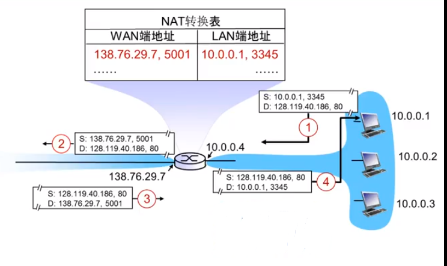

## 网络地址转换NAT

* IPV4地址已经分配殆尽 只能从ISP要到一个IP地址

* 我们使用的一般是一些私有地址

* 所以需要进行网络地址转换来进行通信

* 内部网络无论怎么变化无需通告外网。

* 更变ISP时也无需更变IP地址。

* 外部网络无法直接获取内部设备

路由器进行NAT的条件

1. 路由器必须有至少一个公共IP地址（合法IP）
2. 内部网络的所以IP位私有地址。（这些主机内部通信直接使用私有地址）
3. 内网的主机要想访问公共Internet必须将**源地址**替换为相同的**公共IP地址以及不同的端口号**。

## NAT的实现

1. 替换 利用NAT IP地址，新的端口号。替换每个=外出IP数据报的源IP地址，源端口号。
2. 记录到NAT转换表里面
3. 替换 返回的IP数据报通过转换表替换位内部IP地址。

## NAT争议

1. 路由器应该只处理第三层功能

2. 违背了端到端的通信原则，不应该修改  比如P2P应用程序必须考虑NAT存在
3. 地址缺乏问题应该由IPV6完成

## NAT穿透

外网客户端如何访问内网的服务器？

1. 静态配置NAT 将特点端口连接请求转发给内网服务器 比如 外网138.76.29.7的 2500端口总是发送内网10.0.0.1 的25000端口
2. 利用UPnP协议IGD配置 内网机器学习到NAT公共IP地址（138.76.29.7）在静态表中添加删除端口映射
3. 中继 NAT内部的客户端（内网的客户端）与中继服务器（外部）建立通信。 外部客户端也与外部的中继服务器建立通信。中继服务器完成两个连接的桥接功能。

