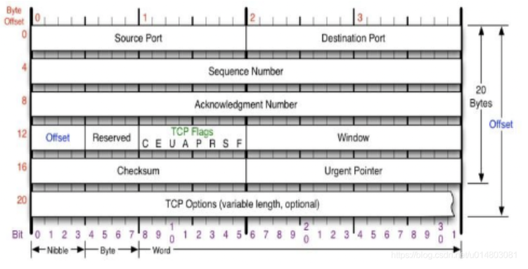
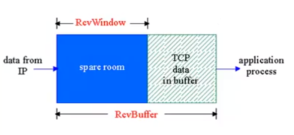
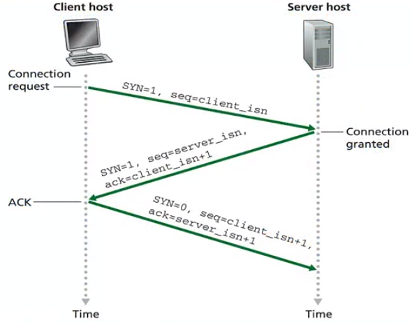
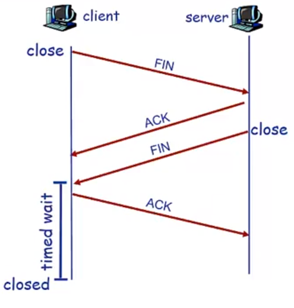
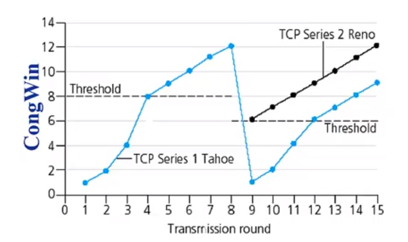

## Tcp特点

**TCP机制**

1. 点对点，一个接受一个发送
2. 可靠的字节流
3. 流水线+滑动窗口协议 (TCP协议取GBN和SR的各自所长)
4. 接收方和发送方都有缓存（偏向SR）

**TCP特点**

	1. 全双工(双向数据流)
	2. 面向连接 (路途中的路由器并不具有连接状态只有双方有)
	3. 流量控制(流量控制和拥塞控制)

## TCP字段

序列号：

	* 序列号是segment中第一个字节的编号。而不是segment的编号
	* 建立TCP连接时，双方随机选择序列号。

ACKs:

	* 希望接受的下一个字节的序列号
	* 累计确认（偏向GBN）：该序列号之前的所有字节均已被正确接收到。

接收方收到乱序到达的Segment 

## TCP可靠数据传输

考虑前提：

1. tcp 使用流水线机制

2. 累计确认机制

3. 只用一个定时器

需要重传的事件：

1. 超时
2. 收到重复ack

目前不考虑拥塞和流量控制

#### 超时时间确定

大于RTT

RTT不是一个常量 它会更具网络状况变化

先测出一个新的SampleRTT  来更新原有的

a = 0.125

RTT = (1- a)*RTT + a * SampleRTT 

β  = 0.25

DevRTT =abs(RTT - SampleRTT ) * β + (1 - β)* DevRTT （rtt的变化量）

定时器超时时间:

TimeoutInerval = RTT  + 4 * DevRTT

### TCP发送方事件

#### 应用层到传输层

1. 创建Segment Segment是第一字节的编号（TCP交给IP发送时Segment会增加发送的data长度作为下一个segment NextSeqNum += length(data)）
2. 开启计时器 
3. 设置TimeoutInerval 

#### 收到ACK

如果是未确认的Segment 向前滑动窗口(更新SendBase)

如果窗口中还有未被确认的组，重启定时器

#### 超时

重传没有被确认过的最小的那个Segment分组，再重启Timer

#### 快速重传

由于TCP发生超时的时间间隔会成倍增长，如果接收方收到乱序分组(有一个分组没到，但后面的先到了)。

那么接收方会发送多个重复ACK，如果发送方收到3个相同ACK，则会在定时器超时前重传。

## 流量控制

蓝色部分为空余的buffer，如果上层应用处理速度比较慢，会导致RevBuffer溢出。

所以接收方要在自己的头部字段将RecvWindow告诉发送方

## 建立连接

三次握手：

1. 客户端发送一个SYN报文段到目标主机，SYN标志位为1 初始序列号Seq 不携带Data
2. 服务器如果可以建立连接会答复一个SYNACK报文段。并且会分配缓存等资源。同时也会初始化序列号Seq。
3. 客户端回复ACK报文段。这个段可以包含数据。

由于服务器收到SYN后会创建资源并且保留一段时间。

如果有大量客户端向服务器发送SYN请求后不回复ACK，会给服务器造成灾难性后果。

## 连接关闭

1. 客户端发送FIN字段的报文段。
2. 服务器会回复ACK关闭连接，并且发送一个FIN报文段给客户端。
3. 客户端收到FIN后回复ACK
4. 客户端进入time wait状态。如果重复收到SYN段的话，客户端会重复发送ACK确保服务器收到并关闭。

## 拥塞控制

CongWin(拥塞窗口)

发送方限制发送速率：

最后发送的数据字节数 - 最后确认的字节数

lastByteSented - LastByteAcked <= CongWin 

rate =  CongWin/RTT   (bytes/sec)

也就是一个RTT里面存在的数据量

其中 CongWin可以动态调整改变发送速率，反应感知到的网络拥塞状况

### 拥塞避免：加性曾 乘性减

每个RTT将CongWin增大一个MSS(最大分段的长度)

当发生一个loss后将CongWin减半

### 慢启动

TCP刚开始增长时 需要很长时间才能达到可用带宽。

所以开始时希望增长为指数型增长

每一个RTT拥塞窗口会翻倍。

### 拥塞避免和慢启动之间的切换

Threshold变量：loss事件发生前的拥塞窗口的一般

Threshold = 1/2 CongWin

如图，在达到Threshold之前为指数增长，当达到后变为线性增长。

发生loss事件后 Threshold变为事件前的1/2 

对于loss事件的处理：

如果收到3个ACK CongWin变为一半。

如果收到Timeout  CongWin变为1。

