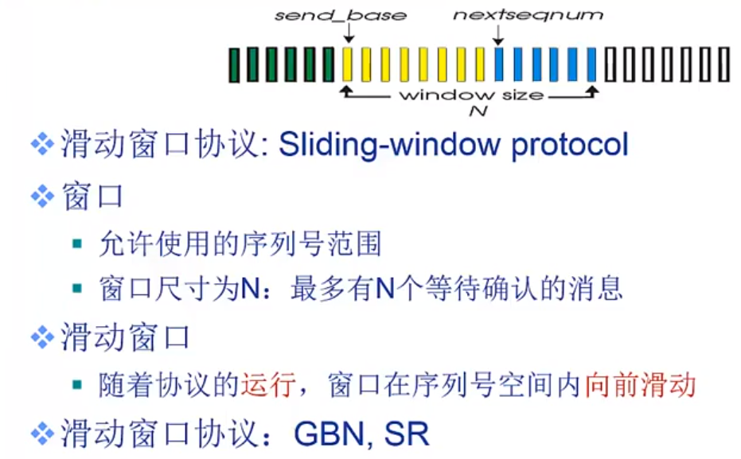
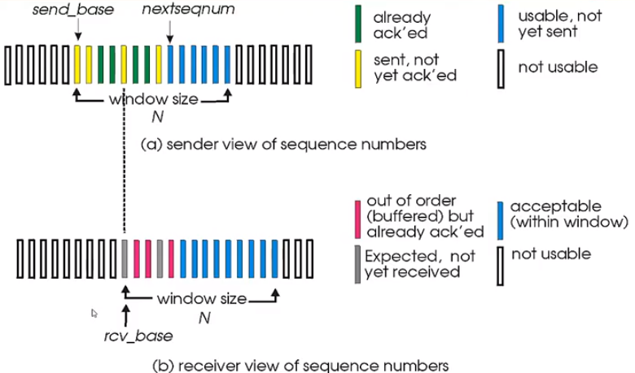
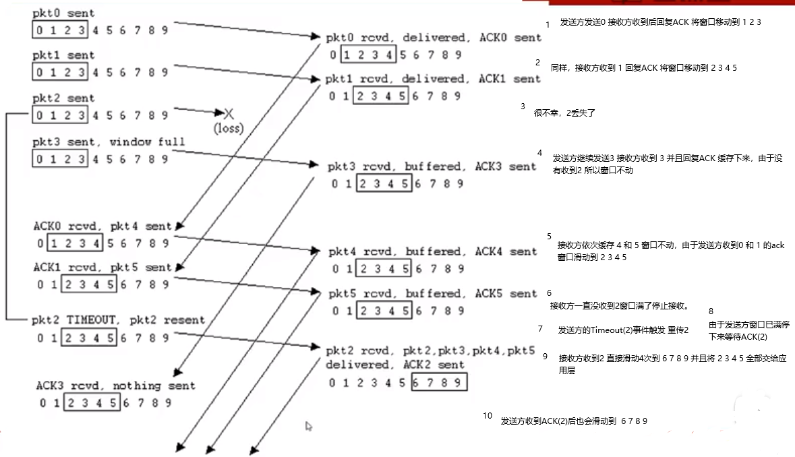

## 流水线

1. 发送方在接到ACK之前连续发送多个分组（缓存分组）。接收方也要有一个接收的（接收缓存分组）。

## 滑动窗口协议

发送方：

图中窗口尺寸为N 窗口左边是已经发送并且受到ACK的。

黄色部分表示已经发出但没收到ACK的。

蓝色表示窗口还剩的序列号范围。

**滑动窗口协议主要是GBN和SR协议**

### Go - back - n协议

假定序列号有k bit 一共有2^k 个序列号(IP数据包)可用

窗口尺寸为N 最多允许有N个序列号不被确认。

GBN协议主要是使用累计确认的方式。

ACK(n):确认到序列号n的分组已经被正确接收了， 可能会收到重复的ACK。

分组会设定一个timer （每个分组可能会被丢失）。如果分组丢失，需要处理timeout(n)事件

在GBN协议中 由于只有一个定时器timer ，当收到一个Timeout(n)事件时，协议会重传大于等于n的所有收到但没回复ACK的数据分组。

如果收到ACK(n)表示n之前的所有序列号都成功到达了。窗口向前滑动一次。

#### 接收方：

没有滑动窗口，回复已经接收的最高分组的ACK

如果有乱序到达的分组。直接丢弃后重新确认序列号最大的按序到达的分组。

## Selective Repeat 协议

SR协议不使用累计确认机制，对每个分组设置单独确认。接收方会缓存乱序到达的数据分组。

所以只会重传没有收到ACK的分组，为每个分组都要设置一个定时器timer。

如下图 

假设窗口大小为4

SR协议在窗口的选择上的要求：

发送方窗口尺寸Ns和接受方的尺寸Nr 要小于等于 总序列2^k

Ns+Nr <= 2^k

