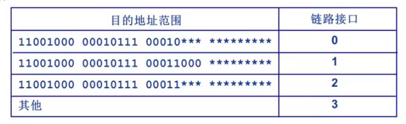

## 网络层服务器类型

### 无连接服务 数据报网络

特点：

1. 不为分组确定特定的传输路径
2. 每个分组独立传输
3. 不同分组可能路径不同
4. 到达目的后与发送顺序可能不同

### 连接服务 虚电路网络

特点：

1. 建立连接时为后续分组确定一条路径
2. 沿相同路径进行传输
3. 系列分组经过的路径相同
4. 传输顺序可以得到保证

## 数据报网络

代表： Internet 网络

无连接

每个分组携带目的地址

路由器根据分组的目的地址转发(路由转发表)

* 基于算法/协议构建转发表
* 检索转发表
* 每个分组独立选路

路由转发表会根据地址范围决定转发的端口

最长前缀匹配优先原则 

## 虚电路网络

代表：ATM网络

虚电路：一条源主机到目的主机的路径（类似于电路）

每个分组利用全部带宽。

路径中所有的网络设备共同完成虚电路功能。

